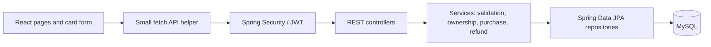

# Card Transaction Simulator — capstone proposal

**Prepared:** October 5, 2026 
**Trial presentation:** October 12, 2026 
**Final presentation:** October 13, 2026 
**Project type:** Individual custom capstone approved by my instructor. AWS implementation and a Jira board are outside the approved scope.

## 1. Problem and business value

Credit card systems must apply transaction rules consistently, protect account access, and preserve a clear history of what happened. This project is a **classroom simulation** of those concerns. A customer can submit a purchase with a fictional test card, see an approval or decline, review transactions, and request a full refund. An administrator can review activity and freeze or reactivate a credit account.

The result demonstrates core modernization ideas through a familiar course architecture: **React → Spring Boot REST controller → service → Spring Data JPA repository → MySQL**. It is not connected to Capital One, Accenture, a payment network, or real money.

## 2. Users and user stories

1. As a visitor, I can read the simulation notice and test-card instructions so I know not to enter real card details.
2. As a visitor, I can register a customer account so I can use the simulator.
3. As a customer, I can sign in and sign out so my account information is protected.
4. As a customer, I can see my credit limit, outstanding balance, and available credit.
5. As a customer, I can enter a fictional card number, expiry, CVV-shaped value, merchant label, and purchase amount with useful field feedback.
6. As a customer, I can submit a purchase and see an approved or declined result with a clear reason.
7. As a customer, I can review my transactions and request one full refund of an approved purchase.
8. As a customer, I cannot view or change another customer's account by changing an ID in the URL or request.
9. As an administrator, I can review customer accounts and transaction outcomes without seeing full card data or CVV.
10. As an administrator, I can freeze and reactivate a credit account; frozen accounts reject new purchases.
11. As a customer, I can safely retry a purchase after an uncertain response without creating a second charge.
12. As a user, I can interact with a flippable virtual card, with an ordinary accessible form available for the same task.

## 3. Functional requirements

**Core application**

| ID | Requirement |
| --- | --- |
| F1 | Register and authenticate users; store passwords with BCrypt. |
| F2 | Issue and validate signed JWTs for protected API requests. |
| F3 | Enforce USER and ADMIN permissions and check account ownership in service methods. |
| F4 | Show each customer their own demo card, credit limit, outstanding balance, and available credit. |
| F5 | Accept only documented fictional test card numbers. Check field format in React and again in Spring Boot. CVV is format-checked and discarded; this simulator cannot verify a real CVV. |
| F6 | Approve a purchase only when the account is active and the amount is positive, has at most two decimal places, and does not exceed available credit. |
| F7 | Record both approved and declined purchase attempts with status, time, amount, merchant label, and a non-sensitive reason code. |
| F8 | Show customer transaction history, newest first. |
| F9 | Allow one full refund for an approved purchase; prevent refunds of declined or already-refunded purchases. |
| F10 | Allow an admin to view account/transaction summaries and freeze or reactivate an account. |
| F11 | Return clear HTTP errors and show loading, success, and failure states in React. |
| F12 | Provide at least five routes: `/`, `/login`, `/dashboard`, `/purchase`, `/transactions`, and `/admin`. Protect routes as appropriate. |

**Retry protection and card interaction**

| ID | Requirement |
| --- | --- |
| E1 | A client-generated request ID and account-scoped uniqueness rule prevent duplicate purchases. An identical retry returns the saved transaction; changed card, merchant, or amount conflicts. |
| E2 | A planned flippable React Three Fiber card previews masked form details without CVV. The HTML form remains usable with a keyboard and reduced-motion preferences. |

## 4. Rules and security boundaries

- **Money:** Java uses `BigDecimal` and MySQL uses `DECIMAL(14,2)`. `available_credit = credit_limit - outstanding_balance`.
- **Approved purchase:** The balance increase and history insert commit together in one database transaction. A declined purchase does not change the balance.
- **Full refund:** A refund links to its original approved purchase and decreases the outstanding balance once. Refunds are full refunds only.
- **Concurrent requests:** The service locks the account row during purchases, refunds, and status changes.
- **Authentication:** BCrypt hashes passwords. JWT signatures can use HS256 (HMAC-SHA-256) with a randomly generated secret of at least 256 bits kept outside source control. SHA-256 alone is not a password-storage algorithm.
- **Card data:** The service accepts the assigned fictional test profile. MySQL stores the card identifier, profile, label, last four digits, and expiry. Full numbers and test security codes stay out of persistence, logs, and responses.
- **Validation:** Regex checks simple field shape; business rules and ownership checks run on the server. A number passing format checks does not prove that a card exists or belongs to anyone.
- **Secrets and logs:** Database credentials and JWT signing keys stay outside Git. Logs exclude passwords, tokens, full card numbers, security codes, and complete request bodies.

## 5. Proposed data model

| Table | Key fields | Purpose |
| --- | --- | --- |
| `app_users` | `id`, `email` unique, `password_hash`, `role`, `display_name` | Customer and admin identities. |
| `credit_accounts` | `id`, `user_id` unique FK, `credit_limit`, `outstanding_balance`, `status` | Credit availability and freeze state. |
| `demo_cards` | `id`, `account_id` unique FK, `test_profile`, `label`, `last_four`, `expiry_month`, `expiry_year` | Assigned fictional card reference. No full number or CVV. |
| `card_transactions` | `id`, `account_id` FK, `card_id` FK, `type`, `status`, `amount`, `outstanding_after`, `merchant_name`, `reason_code`, `original_purchase_id` nullable and unique, `request_id` unique per account, `created_at` | Purchase outcomes and linked full refunds. |

SQL constraints enforce foreign keys, nonnegative money values, permitted statuses, and request-ID uniqueness. The seed data contains fictional customers, an admin, cards, and accounts.

## 6. Architecture and React components

The planned React structure has `App` and routes; `LoginPage`; `DashboardPage`; `PurchasePage` with `PurchaseForm` and `VirtualCard3D`; `TransactionsPage`; `AdminPage`; and small shared components for navigation, notices, loading, and account summary. Each page owns its state, and a small API helper sends requests.

## 7. Initial API outline

| Method | Path | Access | Result |
| --- | --- | --- | --- |
| `POST` | `/api/auth/register` | Public | Create USER with BCrypt password hash. |
| `POST` | `/api/auth/login` | Public | Verify password and issue signed JWT. |
| `GET` | `/api/auth/me` | Signed in | Current user summary. |
| `GET` | `/api/accounts` | USER | Own credit account summaries only. |
| `GET` | `/api/accounts/{id}/cards` | Account owner | Own masked demo cards. |
| `POST` | `/api/accounts/{id}/purchases` | Account owner | Validate test data; return approved or declined transaction. Include request ID for retry protection. |
| `GET` | `/api/accounts/{id}/transactions` | Account owner | Paginated or limited history, newest first. |
| `POST` | `/api/transactions/{id}/refund` | Original account owner | One full refund of eligible purchase. |
| `GET` | `/api/admin/accounts` | ADMIN | Account summaries. |
| `GET` | `/api/admin/transactions` | ADMIN | Transaction summaries, without card secrets. |
| `PATCH` | `/api/admin/accounts/{id}/status` | ADMIN | Freeze or reactivate. |

The [API design](../02_Architecture/03_API_Design.md) defines request and response examples and error codes. Planned controllers handle HTTP input/output; services enforce rules; repositories handle persistence.

## 8. Nonfunctional requirements and evidence

| Area | Target / evidence |
| --- | --- |
| Security | BCrypt passwords, planned JWT validation, role and ownership checks, no secrets in Git, masked card display, no stored CVV. Unauthorized and cross-account requests are rejected. |
| Correctness | A failed purchase or refund leaves the balance unchanged. Balance update and history insert commit together. Tests cover positive and negative paths. |
| Reliability | Duplicate request ID returns the prior purchase result; a changed request with the same ID is rejected. |
| Usability | Responsive layout, labels and clear errors, keyboard-operable form, loading indicators, and a reduced-motion/HTML fallback for 3D. |
| Performance | The target is a prompt dashboard and history response with seeded classroom data on a local machine. Performance measurement is planned. |
| Quality | JUnit service tests, a 70%+ coverage target, and planned Postman collection and code-quality report. |
| Documentation | README, setup steps, ERD, API examples, architecture decisions, test results, and presentation slides. Demo credentials remain in local configuration. |

## 9. Out of scope

Real cards or money; payment network or processor integration; actual CVV verification; PCI compliance certification; fraud scoring or AI; credit bureau integration; interest, statements, billing cycles, fees, and partial refunds; microservices; AWS deployment; and a Jira board. AWS and Jira are omitted based on the instructor's confirmed guidance.

## 10. Schedule and cut lines

| Date | Checkpoint |
| --- | --- |
| **Oct 5** | Approved concept, proposal, user stories, requirements, architecture, ERD, API outline, repository, and README. |
| **Oct 6–7** | Database and backend foundations, with registration, JWT access, roles, and ownership. |
| **Oct 8–9** | Purchase/decline, history, full refund, admin freeze, React forms, and focused tests. Target: an end-to-end purchase demo. |
| **Oct 10** | Flippable 3D card integration alongside the plain form. |
| **Oct 11** | Retry demonstration, tests, API collection, documentation, slides, and demo seed data. |
| **Oct 12** | Trial presentation and fixes. |
| **Oct 13** | Final presentation. |

My priority is transaction correctness, security, and tests. Animation polish can be reduced if the core flow needs more time.

## 11. Demo narrative

My planned demonstration follows this flow: sign in as a customer → show credit availability → enter a documented test card on the form and flip the virtual card → approve a small purchase → show the updated balance and history → retry with the same request ID to demonstrate one charge → show an insufficient-credit decline → sign in as admin to freeze the account → show the next purchase is declined. I will explain BCrypt, signed JWTs, server validation, and database transaction boundaries.

The class banking application informed the direct React → controller → service → repository → MySQL structure. This simulator uses my own implementation and transaction rules.

**Security references:** [OWASP Password Storage](https://cheatsheetseries.owasp.org/cheatsheets/Password_Storage_Cheat_Sheet.html); [OWASP JWT guidance](https://cheatsheetseries.owasp.org/cheatsheets/JSON_Web_Token_Cheat_Sheet.html); [OWASP Input Validation](https://cheatsheetseries.owasp.org/cheatsheets/Input_Validation_Cheat_Sheet.html); [PCI SSC CVV guidance](https://www.pcisecuritystandards.org/faqs/1280/).
