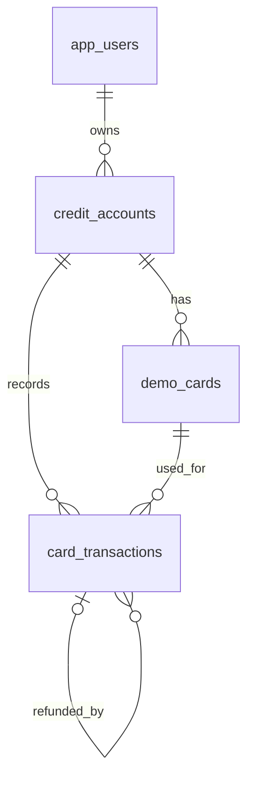
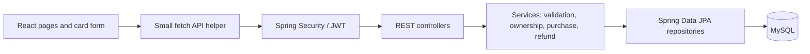

# Card Transaction Simulator — capstone proposal

**Prepared:** October 5, 2026 
**Trial presentation:** October 12, 2026 
**Final presentation:** October 13, 2026 
**Project type:** Individual custom capstone; obtain the instructor's project approval required by the written rubric. The instructor has confirmed that AWS implementation and a Jira board are optional and are not part of this plan.

## 1. Problem and business value

Credit card systems must apply transaction rules consistently, protect account access, and preserve a clear history of what happened. This project is a **classroom simulation** of those concerns. A customer can submit a purchase with a fictional test card, see an approval or decline, review transactions, and request a full refund. An administrator can review activity and freeze or reactivate a credit account.

The result demonstrates core modernization ideas through a familiar course architecture: **React → Spring Boot REST controller → service → Spring Data JPA repository → MySQL**. It is not connected to Capital One, Accenture, a payment network, or real money.

## 2. Users and user stories

1. As a visitor, I can read the simulation notice and test-card instructions so I know not to enter real card details.
2. As a visitor, I can register a customer account so I can use the simulator.
3. As a customer, I can sign in and sign out so my account information is protected.
4. As a customer, I can see my credit limit, outstanding balance, and available credit.
5. As a customer, I can enter a fictional card number, expiry, CVV-shaped value, merchant label, and purchase amount with useful field feedback.
6. As a customer, I can submit a purchase and see an approved or declined result with a clear reason.
7. As a customer, I can review my transactions and request one full refund of an approved purchase.
8. As a customer, I cannot view or change another customer's account by changing an ID in the URL or request.
9. As an administrator, I can review customer accounts and transaction outcomes without seeing full card data or CVV.
10. As an administrator, I can freeze and reactivate a credit account; frozen accounts reject new purchases.
11. As a customer, I can safely retry a purchase after an uncertain response without creating a second charge.
12. As a user, I can interact with a flippable virtual card, with an ordinary accessible form available for the same task.

## 3. Functional requirements

**MVP — complete before the 3D feature**

| ID | Requirement |
| --- | --- |
| F1 | Register and authenticate users; store passwords with BCrypt. |
| F2 | Issue and validate signed JWTs for protected API requests, as the written rubric requires. |
| F3 | Enforce CUSTOMER and ADMIN permissions and check account ownership in service methods. |
| F4 | Show each customer their own demo card, credit limit, outstanding balance, and available credit. |
| F5 | Accept only documented fictional test card numbers. Check field format in React and again in Spring Boot. CVV is format-checked and discarded; this simulator cannot verify a real CVV. |
| F6 | Approve a purchase only when the account is active and the amount is positive, has at most two decimal places, and does not exceed available credit. |
| F7 | Record both approved and declined purchase attempts with status, time, amount, merchant label, and a non-sensitive reason code. |
| F8 | Show customer transaction history, newest first. |
| F9 | Allow one full refund for an approved purchase; prevent refunds of declined or already-refunded purchases. |
| F10 | Allow an admin to view account/transaction summaries and freeze or reactivate an account. |
| F11 | Return clear HTTP errors and show loading, success, and failure states in React. |
| F12 | Provide at least five routes: `/`, `/login`, `/dashboard`, `/purchase`, `/transactions`, and `/admin`. Protect routes as appropriate. |

**Reserved enhancements — after the MVP passes its tests**

| ID | Requirement |
| --- | --- |
| E1 | Prevent duplicate purchases with a client-generated request ID, a database uniqueness constraint, and a consistent response on retry. Reject reuse of an ID for changed account, card, merchant, or amount. |
| E2 | Add a flippable React Three Fiber card tied to the fictional card form. Display masked card digits; never display CVV on the model. Keep a usable HTML form for keyboard access and reduced-motion preferences. |

## 4. Rules and security boundaries

- **Money:** Use Java `BigDecimal` and MySQL `DECIMAL(14,2)`, not floating-point balances. `available_credit = credit_limit - outstanding_balance`.
- **Approved purchase:** Increase outstanding balance and insert the transaction together in one database transaction. A declined purchase does not change the balance.
- **Full refund:** Link to its original approved purchase and decrease outstanding balance once. No partial refunds in this capstone.
- **Concurrent requests:** Lock the account row during balance-changing operations, following the pattern visible in the class banking example.
- **Authentication:** BCrypt hashes passwords. JWT signatures can use HS256 (HMAC-SHA-256) with a randomly generated secret of at least 256 bits kept outside source control. SHA-256 alone is not a password-storage algorithm.
- **Card data:** Use an allowlist of fictional test numbers. Persist only a demo card identifier, label, and last four digits. Do not save or log full card numbers or CVV. Never accept real card details for this simulation.
- **Validation:** Regex checks simple field shape; business rules and ownership checks run on the server. A number passing format checks does not prove that a card exists or belongs to anyone.
- **Secrets and logs:** Keep database credentials and JWT signing keys out of Git. Log transaction IDs and outcomes, not passwords, tokens, card numbers, CVV, or request bodies.

## 5. Proposed data model

| Table | Key fields | Purpose |
| --- | --- | --- |
| `app_users` | `id`, `email` unique, `password_hash`, `role`, `display_name` | Customer and admin identities. |
| `credit_accounts` | `id`, `user_id` FK, `credit_limit`, `outstanding_balance`, `status` | Credit availability and freeze state. |
| `demo_cards` | `id`, `account_id` FK, `label`, `last_four`, `expiry_month`, `expiry_year` | Display-only fictional card reference. No full number or CVV. |
| `card_transactions` | `id`, `account_id` FK, `card_id` FK, `type`, `status`, `amount`, `merchant_label`, `reason_code`, `original_transaction_id` nullable, `request_id` unique per account, `created_at` | Purchase outcomes and linked full refunds. |

Use SQL constraints for foreign keys, nonnegative money values, permitted statuses, and request-ID uniqueness. Seed fictional customer, admin, card, and account data for the demo.

## 6. Architecture and React components

React structure: `App` and routes; `LoginPage`; `DashboardPage`; `PurchasePage` with `CardForm` and later `VirtualCard3D`; `TransactionsPage`; `AdminPage`; and small shared components for navigation, notices, loading, and account summary. Keep state local and use a small API helper rather than a global state library.

## 7. Initial API outline

| Method | Path | Access | Result |
| --- | --- | --- | --- |
| `POST` | `/api/auth/register` | Public | Create CUSTOMER with BCrypt password hash. |
| `POST` | `/api/auth/login` | Public | Verify password and issue signed JWT. |
| `GET` | `/api/auth/me` | Signed in | Current user summary. |
| `GET` | `/api/accounts` | CUSTOMER | Own credit account summaries only. |
| `GET` | `/api/accounts/{id}/cards` | Account owner | Own masked demo cards. |
| `POST` | `/api/accounts/{id}/purchases` | Account owner | Validate test data; return approved or declined transaction. Include request ID for retry protection. |
| `GET` | `/api/accounts/{id}/transactions` | Account owner | Paginated or limited history, newest first. |
| `POST` | `/api/transactions/{id}/refund` | Original account owner | One full refund of eligible purchase. |
| `GET` | `/api/admin/accounts` | ADMIN | Account summaries. |
| `GET` | `/api/admin/transactions` | ADMIN | Transaction summaries, without card secrets. |
| `PATCH` | `/api/admin/accounts/{id}/status` | ADMIN | Freeze or reactivate. |

Document request/response examples and error codes during implementation. Controllers handle HTTP input/output; services enforce rules; repositories handle persistence.

## 8. Nonfunctional requirements and evidence

| Area | Target / evidence |
| --- | --- |
| Security | BCrypt passwords, JWT validation, role and ownership checks, no secrets in Git, masked card display, no stored CVV. Test unauthorized and cross-account requests. |
| Correctness | A failed purchase or refund leaves the balance unchanged. Balance update and history insert commit together. Use tests for positive and negative paths. |
| Reliability | Duplicate request ID returns the prior purchase result; a changed request with the same ID is rejected. |
| Usability | Responsive layout, labels and clear errors, keyboard-operable form, loading indicators, and a reduced-motion/HTML fallback for 3D. |
| Performance | For seeded classroom data, dashboard and history should respond promptly on a local machine; measure and record actual results rather than claiming production scale. |
| Quality | JUnit tests and the rubric's 70%+ coverage target; Postman collection and code-quality report if still required by the instructor. |
| Documentation | README, setup steps, ERD, API examples, architecture decisions, test results, demo credentials, and presentation slides. |

## 9. Out of scope

Real cards or money; payment network or processor integration; actual CVV verification; PCI compliance certification; fraud scoring or AI; credit bureau integration; interest, statements, billing cycles, fees, and partial refunds; microservices; AWS deployment; and a Jira board. AWS and Jira are omitted based on the instructor's confirmed guidance. This does not waive other written rubric items, including JWT, testing, and presentation requirements.

## 10. Schedule and cut lines

| Date | Checkpoint |
| --- | --- |
| **Oct 5** | Obtain approval for this custom concept; finalize proposal, user stories, requirements, architecture, ERD, API outline, repository, and README skeleton. |
| **Oct 6–7** | Build MySQL schema, entities, repositories, BCrypt registration/login, JWT access, roles, and ownership checks. |
| **Oct 8–9** | Build purchase/decline, history, full refund, admin freeze, React forms, and focused tests. **MVP checkpoint: an end-to-end purchase demo works.** |
| **Oct 10** | Build and integrate the flippable 3D card, preserving the plain form. |
| **Oct 11** | Add duplicate-submission protection; complete tests, API collection, documentation, slides, and demo seed data. |
| **Oct 12** | Trial presentation and fixes. Stop adding features. |
| **Oct 13** | Final presentation. |

If time tightens, reduce animation polish before reducing transaction correctness, security, or tests. The 3D card keeps its reserved build day; duplicate protection is the first enhancement to defer if the MVP or 3D integration needs repair.

## 11. Demo narrative

Sign in as a customer → show credit availability → enter a documented test card on the form and flip the virtual card → approve a small purchase → show the updated balance and history → retry with the same request ID to demonstrate one charge → show an insufficient-credit decline → sign in as admin to freeze the account → show the next purchase is declined → explain BCrypt, signed JWTs, server validation, database transaction boundaries, and the no-real-card-data rule.

## 12. Day 1 decisions to confirm

1. Instructor approval of the **custom Card Transaction Simulator** concept (the PDF requires approval for a custom project).
2. Instructor confirmation of how the AWS and Jira waivers affect the final submission checklist.
3. Whether the Postman collection, SonarQube report, five React routes, and 70% coverage remain required exactly as written; plan to satisfy them until told otherwise.

**Source basis:** UCI 2123 capstone PDF, the attached course learning-scope notes, and the supplied banking lesson. The banking ZIP is an instructor solution used as a learning reference; this capstone should be implemented and documented as the student's own work.

**Security references:** [OWASP Password Storage](https://cheatsheetseries.owasp.org/cheatsheets/Password_Storage_Cheat_Sheet.html); [OWASP JWT guidance](https://cheatsheetseries.owasp.org/cheatsheets/JSON_Web_Token_Cheat_Sheet.html); [OWASP Input Validation](https://cheatsheetseries.owasp.org/cheatsheets/Input_Validation_Cheat_Sheet.html); [PCI SSC CVV guidance](https://www.pcisecuritystandards.org/faqs/1280/).
