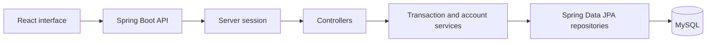
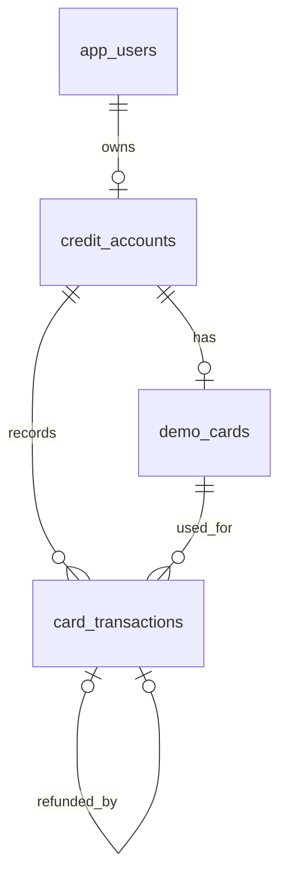
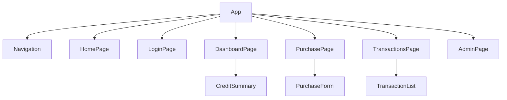

# Credit Card Transaction Simulator

**UCI 2123 Capstone Project Proposal** 
**October 6, 2026**

## MVP scope update — October 8, 2026

Following instructor feedback, the immediate target is a working local flow that I can explain: sign in → account summary → purchase approval/decline → history → full refund, plus a simple admin freeze/reactivate page. The backend follows controller → service → repository → MySQL with four tables. Purchase input uses one DTO; small scalar operations use parameters. The current backend has purchase/refund/admin rules, but authentication and customer/admin React screens are still unfinished.

The 3D card, login rate limiting, a build pipeline, SonarQube review, and a numerical coverage target are deferred enhancements. These are no longer MVP completion requirements. Core role/ownership checks, BCrypt passwords, server-session authentication, safe card handling, and consistent balance/history writes remain required. The smaller plan uses a session cookie with CSRF protection instead of JWTs. Lists are plain arrays, errors have one message, and the backend uses ordinary classes, explicit loops, and five DTOs. AWS and Jira remain outside the approved scope. Earlier proposal drafts are retained as historical references; the current architecture documents describe this smaller implementation plan.

## Project overview

I will build a web application that simulates credit card purchases with fictional accounts and test cards. A customer will be able to sign in, see their available credit, submit a purchase, and review the result in a transaction history. The application will approve or decline the purchase based on the account’s status and available credit. Customers will also be able to request a full refund. An administrator will be able to review activity and freeze or reactivate accounts.

The application will use React for the interface, Spring Boot for the API and transaction rules, and MySQL for persistent data. The database mappings, repositories, account and transaction services, HTTP controllers, and shared error handling are implemented. Authentication and the React interface are planned. It is an independent simulation. It will not connect to Capital One, Accenture systems, a payment network, or real money.

## Problem and business case

A purchase request can fail in several ways even when the form looks correct. A customer might submit the same request twice, a transaction might exceed the available credit, or an API might return another customer’s information if it checks the user’s role but not account ownership. An approved purchase also needs its balance change and history record to stay in sync.

This project brings those concerns into one small application that I can demonstrate end to end. The customer sees a clear result, while the backend makes the decision, records what happened, and protects the account. It gives me a practical way to work with the same kinds of validation, security, and transaction consistency concerns that matter in financial software.

## Users and user stories

The application has two signed-in roles: **USER** for customers and **ADMIN** for account oversight. Visitors can see that the application is a simulation and can create a customer account.

1. As a visitor, I can see that the application uses fictional cards and money before I enter any information.
2. As a visitor, I can register an account and sign in.
3. As a customer, I can see my credit limit, outstanding balance, and available credit.
4. As a customer, I can see my test card with only its last four digits visible.
5. As a customer, I can enter a test card number, expiration date, test security code, merchant name, and purchase amount and receive clear form errors.
6. As a customer, I can submit a purchase and see whether it was approved or declined and why.
7. As a customer, I can review my purchase and refund history in date order.
8. As a customer, I can request one full refund for an approved purchase.
9. As a customer, I can retry a purchase after a connection problem without creating a second transaction.
10. As a customer, I cannot see or change another customer’s account by editing an account ID in a request.
11. As an administrator, I can review customer accounts and transaction outcomes without seeing full card numbers or security codes.
12. As an administrator, I can freeze or reactivate an account and know that a frozen account cannot make new purchases.
13. As a user, I can complete a labeled purchase form with keyboard access. A card animation is a deferred enhancement.

## Functional requirements

| ID | Requirement |
| --- | --- |
| FR1 | Visitors can register a USER account with an assigned fictional credit account and test card. Users can sign in and sign out. Passwords are stored as BCrypt hashes. |
| FR2 | The API uses server sessions and cookies for protected requests, with CSRF protection when browser sign-in is enabled. USER and ADMIN permissions are enforced on the server. |
| FR3 | Customers can retrieve only their own accounts, masked test cards, and transactions. |
| FR4 | The dashboard shows credit limit, outstanding balance, and available credit. Available credit equals the limit minus the outstanding balance. |
| FR5 | The purchase form accepts only documented fictional test card numbers assigned to the customer. It checks number and test security-code format, expiration, merchant name, and amount. The server repeats the checks. |
| FR6 | An active account approves a purchase only when the amount is positive, has no more than two decimal places, and fits within available credit. |
| FR7 | A valid purchase declined for an expired assigned card, frozen account, or insufficient credit records its outcome and reason without changing the balance. Malformed input creates no transaction. |
| FR8 | An approved purchase updates the outstanding balance and saves its transaction record together. |
| FR9 | Customers can view transaction history, newest first, with approved, declined, and refunded outcomes clearly labeled. |
| FR10 | Customers can request a full refund of an approved purchase once, including on a frozen account. The refund is linked to the original purchase and restores the appropriate available credit. |
| FR11 | Each purchase has a unique request ID. Retrying the same request returns the original result; reusing the ID with different purchase details is rejected. |
| FR12 | Administrators can view account and transaction summaries and change an account between ACTIVE and FROZEN. A frozen account rejects new purchases. |
| FR13 | Deferred enhancement: a flippable card preview. The MVP uses a normal labeled purchase form with keyboard access. |
| FR14 | The interface provides loading states and readable success and error messages. It includes separate routes for home, login, dashboard, purchase, transactions, and administration. |

## Nonfunctional requirements

**Security and privacy.** Passwords will use BCrypt. Sign-in will establish a server session after verifying the BCrypt hash. A session cookie identifies later requests, and browser sign-in will include CSRF protection. JWTs are outside this MVP. The API will check both role and account ownership. Login rate limiting is deferred beyond the local MVP. Only predefined fictional card numbers will be accepted. The database will keep a card ID and last four digits, but not a full card number or CVV. Sensitive values will not appear in logs or the 3D card display.

**Correctness and reliability.** Money values will use `BigDecimal` in Java and `DECIMAL(14,2)` in MySQL. A balance change and its transaction record will commit together or not at all. The account will be locked while a balance-changing request is processed so simultaneous purchases cannot spend the same available credit. A database uniqueness rule will back the duplicate-submission check. Invalid requests and failed refunds will leave the balance unchanged.

**Performance and growth.** The dashboard and transaction history should load within two seconds during the local demonstration with seeded data. Transaction history uses a plain newest-first array for the small local dataset; commonly searched account and transaction columns are indexed. The application is designed for a small demo dataset; I am not claiming it can run a production card network.

**Usability and accessibility.** The interface will work on desktop and mobile widths. Forms will have labels, specific error messages, and keyboard access. The 3D card will respect reduced-motion preferences, and the standard form will remain fully functional without it.

**Testing and code quality.** JUnit and MySQL checks cover service rules and important failure cases. API requests will be documented in a Postman collection, and local backend verification/frontend builds must pass. A numerical coverage target, automated build pipeline, and SonarQube review are deferred enhancements.

## System design

The browser sends requests to the Spring Boot API. A server session identifies the caller; services check the stored role and account ownership. Controllers pass the request to services, where ownership, card-test-data rules, credit limits, refunds, and duplicate submissions are checked. Repositories save users, accounts, cards, and transactions in MySQL.

### Database design

| Table | Main fields and relationships |
| --- | --- |
| `app_users` | `id` primary key, `display_name`, unique `email`, `password_hash`, `role` |
| `credit_accounts` | `id` primary key, `user_id` foreign key, `credit_limit`, `outstanding_balance`, `status` |
| `demo_cards` | `id` primary key, `account_id` foreign key, `test_profile`, `label`, `last_four`, `expiry_month`, `expiry_year` |
| `card_transactions` | `id` primary key, `account_id` and `card_id` foreign keys, `type`, `status`, `amount`, `outstanding_after`, `merchant_name`, `reason_code`, `created_at`, `request_id`, optional `original_purchase_id` for refunds |

### API design

The purchase and refund endpoints will return transaction status and the account’s updated credit summary. Errors use an HTTP status and one safe message. Successful purchases/refunds return 200 with the saved outcome and current account summary.

| Method | Endpoint | Request fields | Response fields |
| --- | --- | --- | --- |
| POST | `/api/auth/register` | display name, email, password | user ID, display name, email, role |
| POST | `/api/auth/login` | email, password | session cookie and safe user details |
| GET | `/api/auth/me` | session | user ID, name, email, role |
| GET | `/api/accounts` | session | own account IDs, limits, balances, statuses |
| GET | `/api/accounts/{id}/cards` | session, account ID | card IDs, labels, masked numbers, expiry |
| POST | `/api/accounts/{id}/purchases` | session, account ID, card ID, test card number, expiry, test security code, merchant, amount, request ID | transaction ID, status, reason, updated credit summary |
| GET | `/api/accounts/{id}/transactions` | session, account ID | transaction IDs, types, amounts, statuses, dates, reasons |
| POST | `/api/transactions/{id}/refund` | session, purchase ID, request ID | refund transaction ID, status, updated credit summary |
| GET | `/api/admin/accounts` | ADMIN session | account IDs, owners, limits, balances, statuses |
| GET | `/api/admin/transactions` | ADMIN session | transaction summaries without card secrets |
| PATCH | `/api/admin/accounts/{id}/status` | ADMIN session, ACTIVE or FROZEN | account ID and new status |

### React component structure

## What this project will not do

The application will not accept real payment cards, move real money, connect to a processor, verify an actual CVV, or claim PCI compliance. It will not calculate interest, generate monthly statements, make credit decisions, or run fraud models. Refunds will be full refunds only. Cloud deployment and a Jira board are not included, as agreed with my instructor. The finished application will be demonstrated locally.

## What I will show in the presentation

I will sign in as a customer, show the available credit, enter a fictional test card, and submit a purchase. I will show the saved transaction and balance change, then demonstrate a decline, a refund, and a retry that does not create a second purchase. I will also show an administrator freezing an account. A card animation is optional after the main workflows are complete. The demo will use fictional users and balances throughout.
