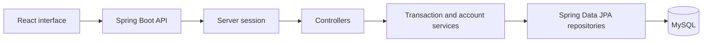
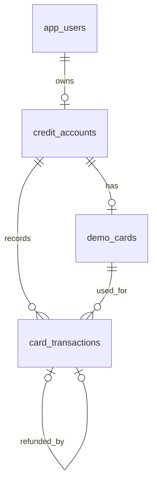
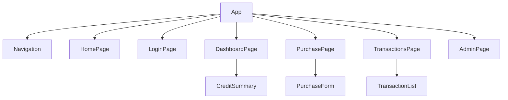

# Credit Card Transaction Simulator

**UCI 2123 Capstone Project Proposal** 
**October 6, 2026**

## MVP scope update — October 8, 2026

Following instructor feedback, the immediate target is a working local flow that I can explain: sign in → account summary → purchase approval/decline → history → full refund, plus a simple admin freeze/reactivate page. The backend follows controller → service → repository → MySQL with four tables. Purchase input uses one DTO; small scalar operations use parameters. The current backend has purchase/refund/admin rules, but authentication and customer/admin React screens are still unfinished.

## Project overview

I will build a web application that simulates credit card purchases with fictional accounts and test cards. A customer will be able to sign in, see their available credit, submit a purchase, and review the result in a transaction history. The application will approve or decline the purchase based on the account’s status and available credit. Customers will also be able to request a full refund. An administrator will be able to review activity and freeze or reactivate accounts.

The application will use React for the interface, Spring Boot for the API and transaction rules, and MySQL for persistent data. The database mappings, repositories, account and transaction services, HTTP controllers, and shared error handling are implemented. Authentication and the React interface are planned. It is an independent simulation. It will not connect to Capital One, Accenture systems, a payment network, or real money.

## Problem and business case

A purchase request can fail in several ways even when the form looks correct. A customer might submit the same request twice, a transaction might exceed the available credit, or an API might return another customer’s information if it checks the user’s role but not account ownership. An approved purchase also needs its balance change and history record to stay in sync.

This project brings those concerns into one small application that I can demonstrate end to end. The customer sees a clear result, while the backend makes the decision, records what happened, and protects the account. It gives me a practical way to work with the same kinds of validation, security, and transaction consistency concerns that matter in financial software.

## Users and user stories

The application has two signed-in roles: **USER** for customers and **ADMIN** for account oversight. Visitors can see that the application is a simulation and can create a customer account.

1. As a visitor, I can see that the application uses fictional cards and money before I enter any information.
2. As a visitor, I can register an account and sign in.
3. As a customer, I can see my credit limit, outstanding balance, and available credit.
4. As a customer, I can see my test card with only its last four digits visible.
5. As a customer, I can enter a test card number, expiration date, test security code, merchant name, and purchase amount and receive clear form errors.
6. As a customer, I can submit a purchase and see whether it was approved or declined and why.
7. As a customer, I can review my purchase and refund history in date order.
8. As a customer, I can request one full refund for an approved purchase.
9. As a customer, I can retry a purchase after a connection problem without creating a second transaction.
10. As a customer, I cannot see or change another customer’s account by editing an account ID in a request.
11. As an administrator, I can review customer accounts and transaction outcomes without seeing full card numbers or security codes.
12. As an administrator, I can freeze or reactivate an account and know that a frozen account cannot make new purchases.
13. As a user, I can complete a labeled purchase form with keyboard access. A card animation is a deferred enhancement.

## Functional requirements

## Nonfunctional requirements

**Correctness and reliability.** Money values will use `BigDecimal` in Java and `DECIMAL(14,2)` in MySQL. A balance change and its transaction record will commit together or not at all. The account will be locked while a balance-changing request is processed so simultaneous purchases cannot spend the same available credit. A database uniqueness rule will back the duplicate-submission check. Invalid requests and failed refunds will leave the balance unchanged.

**Performance and growth.** The dashboard and transaction history should load within two seconds during the local demonstration with seeded data. Transaction history uses a plain newest-first array for the small local dataset; commonly searched account and transaction columns are indexed. The application is designed for a small demo dataset; I am not claiming it can run a production card network.

**Usability and accessibility.** The interface will work on desktop and mobile widths. Forms will have labels, specific error messages, and keyboard access. The 3D card will respect reduced-motion preferences, and the standard form will remain fully functional without it.

## System design

### Database design

| Table | Main fields and relationships |
| --- | --- |
| `app_users` | `id` primary key, `display_name`, unique `email`, `password_hash`, `role` |
| `credit_accounts` | `id` primary key, `user_id` foreign key, `credit_limit`, `outstanding_balance`, `status` |
| `demo_cards` | `id` primary key, `account_id` foreign key, `test_profile`, `label`, `last_four`, `expiry_month`, `expiry_year` |
| `card_transactions` | `id` primary key, `account_id` and `card_id` foreign keys, `type`, `status`, `amount`, `outstanding_after`, `merchant_name`, `reason_code`, `created_at`, `request_id`, optional `original_purchase_id` for refunds |

### API design

The purchase and refund endpoints will return transaction status and the account’s updated credit summary. Errors use an HTTP status and one safe message. Successful purchases/refunds return 200 with the saved outcome and current account summary.

### React component structure

## What this project will not do

The application will not accept real payment cards, move real money, connect to a processor, verify an actual CVV, or claim PCI compliance. It will not calculate interest, generate monthly statements, make credit decisions, or run fraud models. Refunds will be full refunds only. Cloud deployment and a Jira board are not included, as agreed with my instructor. The finished application will be demonstrated locally.

## What I will show in the presentation

I will sign in as a customer, show the available credit, enter a fictional test card, and submit a purchase. I will show the saved transaction and balance change, then demonstrate a decline, a refund, and a retry that does not create a second purchase. I will also show an administrator freezing an account. A card animation is optional after the main workflows are complete. The demo will use fictional users and balances throughout.

## Scope correction - October 8, 2026

The instructor waived AWS and related deployment/DevOps work. Jira and branch protection are outside this completion pass. JWT authentication, BCrypt, validation, pagination, OpenAPI, authentication rate limiting, coverage, Postman, and SonarQube remain required. Java coverage must meet 70%; the Excellent target is 80%+. The 3D card remains planned after the required application works. Presentation rehearsal is October 12; presentation and submission are October 13.

The older session-only implementation is being replaced by one signed JWT approach with tokens in React memory. Required work and evidence are tracked in [the completion checklist](../03_Verification/01_Completion_Checklist.md).
