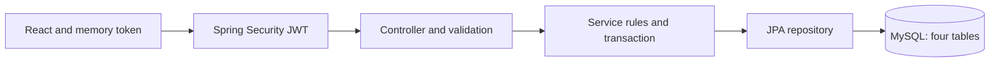

# Credit Circuit

**UCI 2123 individual capstone proposal and implementation scope**
**Updated October 10, 2026**

## Problem and solution

A purchase can exceed available credit, arrive twice after a connection problem, or reach the wrong account if an API checks only a role. Its balance change also needs to stay consistent with history. I built Credit Circuit to demonstrate these concerns in a small simulator that I can trace from React to MySQL.

Customers register, sign in, view credit and a masked fictional card, submit purchases, review history, and request a full refund. Administrators review account/activity pages and freeze/reactivate accounts. The application uses fictional identities, cards, merchants, and balances. It connects to no bank, processor, payment network, or real money.

## Users and stories

1. As a visitor, I can read the simulation notice before entering information.
2. As a visitor, I can register without choosing ADMIN.
3. As a user, I can sign in/out and receive an expiration message.
4. As a customer, I can see my limit, outstanding balance, and available credit.
5. As a customer, I can see my assigned card masked by default, briefly reveal fictional details, and use it to prefill a purchase.
6. As a customer, I can complete a labeled purchase form and correct specific errors.
7. As a customer, I can see approval or a saved decline with its reason.
8. As a customer, I can page history, newest first.
9. As a customer, I can request one full refund of an approved purchase.
10. As a customer, I can retry an uncertain purchase/refund with its original UUID.
11. As a customer, I cannot access another customer's data by editing an ID.
12. As an administrator, I can page safe account/activity summaries.
13. As an administrator, I can freeze spending and reactivate accounts while eligible refunds remain available.
14. As a keyboard user, I can reach fields, errors, navigation, dialogs, and wide tables.
15. As a user, I can flip a fictional 3D card on home, dashboard, and purchase pages, with keyboard controls, an ordinary purchase form, and a reduced-motion fallback.

## Functional requirements

| Requirement | Implementation |
| --- | --- |
| Register | Always create USER, credit account, and fictional card together; reject duplicate email safely. |
| Sign in and identify the user | BCrypt password checks, signed JWT login, and a current-user endpoint. |
| Sign out and expire access | Discard memory access on sign-out/reload/expiry and explain when another sign-in is needed. |
| Authorize | USER/ADMIN routes plus stored-role and account-ownership checks. |
| View credit | Show the customer's limit, outstanding balance, available credit, and account status. |
| View the assigned card | Show masked details, expiry, and loaded account status; explicitly reveal fictional number/sample code with automatic hiding. Use this card prefills number/expiry in memory. |
| Purchase | Assigned fictional card/expiry, positive decimal amount, active account, available credit. Expired/frozen/insufficient-credit outcomes save declines. |
| Duplicate protection | Account/request UUID, identical retry returns saved result, changed details conflict. |
| Review history | Page the customer's transaction outcomes newest first, including refund links/status. |
| Refund | One full reversal of an owned approved purchase, including while frozen. |
| Review accounts as admin | Page safe customer account summaries. |
| Review activity as admin | Page transaction activity across accounts. |
| Change account status as admin | Explicitly freeze spending or reactivate an account. |
| API | Bean Validation, safe custom exceptions, bounded pages, OpenAPI, 201 creation/200 retry statuses. |
| Interface | Controlled forms, errors, pending controls, spinner/skeleton, role routes, responsive keyboard access. |

## Nonfunctional requirements

I use BigDecimal/DECIMAL(14,2). Account locks serialize balance changes. A database transaction commits balance/history together or rolls both back. Unique constraints back duplicate requests and one-refund rules. Financial history has no cascade deletion.

BCrypt hashes passwords. Framework support verifies signed tokens and intended claims. The signing key stays outside Git. React holds access in memory and attaches it explicitly. CORS limits browser origins and authentication has a bounded local rate limiter. CSRF follows the actual bearer-header transport without cookie authentication. No password, issued token, full card number, security code, or request body is logged or persisted as application data.

The interface supports desktop/tablet/phone widths, labeled controls, focus feedback, and clear loading/failure states. For local scalability, paged lists bound returned data, indexes support frequent queries, and the authentication limiter bounds its in-memory entries. This is a single-process classroom dataset, not a production card network. The original two-second loading goal remains a demo target, not a load-test result.

Quality requirements are JUnit/MySQL success/failure tests, a measured 70% minimum Java coverage gate with an 80%+ goal, an exercised Postman export, and actual SonarQube analysis with critical/major findings addressed.

## Design and evidence

The tables are app_users, credit_accounts, demo_cards, and card_transactions. See the [ERD](../02_Architecture/02_Entity_Relationship_Diagram.md), [architecture](../02_Architecture/01_System_Architecture.md), [API](../02_Architecture/03_API_Design.md), [React diagram](../02_Architecture/04_React_Component_Diagram.md), and [actual verification](../03_Verification/01_Completion_Checklist.md).

## Approved scope and remaining work

My instructor waived AWS and related infrastructure, deployment pipelines, and cloud monitoring. Jira and branch protection are outside this pass. Other written application/quality requirements remain required. The application runs locally.

The shared Three.js card includes rounded edges, hover foil gradient, and idle shimmer. The dashboard adds temporary reveal/hide controls, a 20-second/focus-loss privacy timer, a Use this card purchase shortcut, and ACTIVE/FROZEN appearance. Full fictional details stay in memory only; public cards remain masked. Reduced motion and the HTML/CSS graphics fallback remain supported.
