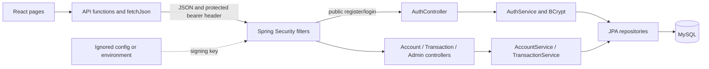
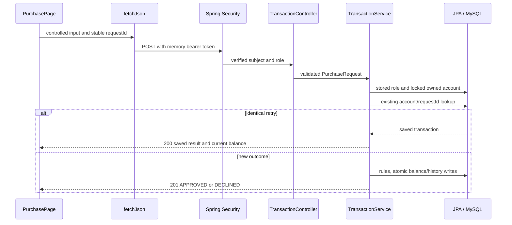

# System architecture

Credit Circuit is a local React application calling one Spring Boot API and one MySQL database. I kept the class banking app's familiar controller/service/repository flow and wrote the simulator's own rules.

React owns controlled fields, loading/errors, confirmations, and memory-only access. fetchJson adds Authorization and expires UI access on a protected 401. Context shares safe identity. The server authorizes and calculates balances.

Spring Security verifies HS256 signature/algorithm, expiry, issuer, exact audience, numeric subject, role, and issue/expiry claims. Public register/login and USER/ADMIN routes are explicit. No login session or authentication cookie is accepted. CORS allows local origins without credentials. Authentication has a bounded ten-attempt/minute limit per IP/process. The [API contract](03_API_Design.md) explains CSRF and logout limits.

Controllers validate request shape/page bounds and call services directly. AuthService atomically creates user/account/card and checks BCrypt. AccountService handles role/ownership/summaries. TransactionService handles purchases/refunds/history. Repositories query rows and lock accounts. MySQL enforces foreign keys, allowed values, balance bounds, and uniqueness.

Balance/history share a transaction. READ_COMMITTED and pessimistic account locks protect concurrent changes/retries. CreditAccount and DemoCard provide their display JSON directly through getters. @JsonIgnore excludes their relationships and internal card fields. Repository entity graphs load the owner or linked account needed by display getters before the service transaction closes. TransactionResponse still copies transaction display fields inside service transactions. Authentication returns AppUser directly: it has no entity relationships, and @JsonIgnore excludes its passwordHash field and getter. No cascade deletes financial history. Four tables remain sufficient.

## Separation of concerns

I kept each part responsible for a specific job in the existing application flow.

| Part | Responsibility |
| --- | --- |
| React pages | Form values, loading/error states, user actions, and displaying API results. |
| Shared React components | Labels, buttons, tables, dialogs, and other repeated interface behavior. |
| UserUiContext / ProtectedRoute | Memory-only sign-in state, expiration, and navigation access. |
| creditCircuitApi / fetchJson | Endpoint paths, request encoding, bearer headers, response parsing, and safe request errors. |
| Spring Security | Token verification, route-level roles, CORS, and authentication rate limiting. |
| Controllers | HTTP paths, input validation, verified identity, response status, and direct service calls. |
| Services | Registration/login workflows, stored roles, ownership, purchase/refund rules, and transaction boundaries. |
| Repositories | Database searches, pagination queries, and account-lock queries. |
| Entities / MySQL | Stored fields, relationships, database constraints, and safe user/account/card display getters. |
| Response classes / exception handler | Response fields and safe HTTP error formatting. |

The browser checks form input for immediate feedback. Bean Validation checks incoming format on the server. Services make the financial decisions using stored data. MySQL constraints protect valid stored state. These checks serve different responsibilities; the browser does not decide approval, refund eligibility, or the saved balance. CreditAccount calculates available credit for display, while TransactionService checks available credit before spending.

The separation has a few small-project compromises. Services use ResponseStatusException and response classes, which connect them to the REST API. AppUser, CreditAccount, and DemoCard also serve as API responses, so their serialized fields are part of the API contract. Password hashes, linked entities, and internal card fields remain excluded. Response tests check the exact account/card fields. AccountService shares role checks with TransactionService, and AuthService coordinates three repositories to create the customer/account/card in one transaction. I kept those direct calls within the service layer without adding more classes.

The application runs locally using the [backend](../../backend/README.md), [frontend](../../frontend/README.md), and [SQL](../../sql/README.md) setup instructions. AWS deployment is waived.
