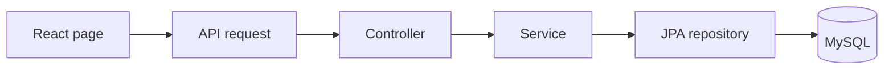

# System architecture

Updated October 8, 2026 — the beginner MVP.

One React frontend, one Spring Boot API, one MySQL database. The design follows the class banking application's direct workflow:

The database has users, credit accounts, demo cards, and transaction history. Java relationships follow foreign keys in one direction; there are no reverse collections to synchronize.

## One purchase

The planned React purchase page sends eight fields to TransactionController. TransactionService checks the customer's stored role, validates input, locks the owned account, verifies the assigned fictional card, and checks the request ID. A saved retry returns its original transaction. For a new request, the service checks expiry, frozen status, and available credit in that order. Approval increases the balance; a decline preserves it. Both save a history row and return a safe result with HTTP 200.

The account lock makes balance changes take turns. A database transaction saves balance/history together or neither. The account/request-ID unique constraint backs the retry check. These are the only special coordination rules.

## Other workflows

Customers see account/card summaries and a newest-first history array. A full refund copies an approved purchase amount, subtracts it from the balance, and saves a linked reversal once. Admins see the same account/transaction response shapes and can set ACTIVE/FROZEN. Freezing prevents new spending and allows valid refunds.

## Authentication and scope

Today no endpoint creates a logged-in session, so external `/api` calls receive 401. Tests install a session on mock server requests; this mechanism is not an HTTP login shortcut. Services independently check the stored role and resource ownership.

Money uses BigDecimal and DECIMAL(14,2). Full fictional card numbers/security codes exist only in request memory; responses expose masked details. Passwords, request bodies, card fields, and credentials are excluded from logs. The application runs locally with fictional money and no bank/payment-network integration.

## MVP design choices

The remaining structure demonstrates three things: Java request handling, relational persistence, and correct credit-card balance behavior. Controllers handle HTTP, services make decisions, and repositories handle storage. Four entities and four repositories match the four tables. Five DTOs cover purchase input, account summary, masked card, history entry, and a purchase/refund result.

Keep BigDecimal, ownership/role checks, duplicate-request checks, one-refund rules, and transactional balance/history updates. Each supports a specific behavior in the demonstration. Combining these layers or returning database entities directly would make the code harder to explain safely. The next step is completing sign-in and the ordinary React forms using this same workflow.

No custom configuration class is currently needed. Runtime settings live in `backend/src/main/resources/application.properties`; the unused empty `config` directory has been removed.

## Scope correction - October 8, 2026

The instructor waived AWS and related deployment/DevOps work. Jira and branch protection are outside this completion pass. JWT authentication, BCrypt, validation, pagination, OpenAPI, authentication rate limiting, coverage, Postman, and SonarQube remain required. Java coverage must meet 70%; the Excellent target is 80%+. The 3D card remains planned after the required application works. Presentation rehearsal is October 12; presentation and submission are October 13.

The older session-only implementation is being replaced by one signed JWT approach with tokens in React memory. Required work and evidence are tracked in [the completion checklist](../03_Verification/01_Completion_Checklist.md).
