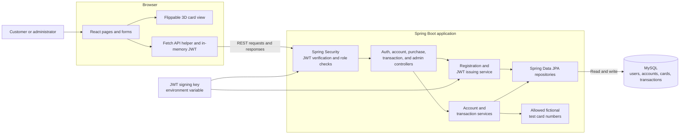

# System Architecture

**Credit Card Transaction Simulator** 
**October 6, 2026**

## Overview

The application has one React frontend, one Spring Boot backend, and one MySQL database. Customers use the frontend to view their credit account, submit fictional card purchases, request refunds, and read transaction history. Administrators use a separate view to review activity and freeze or reactivate accounts. The Spring Boot service makes every account and transaction decision; the browser displays the result.

The system runs locally for the capstone demonstration. It does not connect to a bank, payment network, or payment processor. All cards, balances, and transactions are fictional.

## Component diagram

The 3D card is a view of the form state. It does not make a separate API request or decide whether a transaction is valid. The regular HTML fields remain usable without the 3D view.

## What each part does

| Part | Responsibility |
| --- | --- |
| React pages and forms | Show credit information, collect fictional purchase details, display errors and transaction results, and provide customer and admin navigation. |
| Flippable 3D card | Preview a masked test card and flip between its front and back. It never displays the entered security code. |
| Fetch API helper | Send requests, attach the JWT to protected requests, and handle loading and error responses. The token is held in memory; a page refresh requires a new sign-in. |
| Spring Security | Allow public registration and login, validate JWTs on protected routes, and enforce USER or ADMIN access. |
| Controllers | Receive HTTP requests and return consistent status codes and response bodies. They do not calculate balances. |
| Registration and JWT service | Create customer accounts, use BCrypt for passwords, and issue signed tokens after successful login. |
| Account and transaction services | Check account ownership, validate purchases and refunds, apply credit rules, and coordinate database transactions. |
| JPA repositories | Read and save users, credit accounts, demo cards, and transaction records. |
| MySQL | Persist users, BCrypt password hashes, account balances and states, masked card references, and transaction history. Constraints protect relationships and unique request IDs. |

## Main request flows

### Sign-in

1. The customer submits an email and password to the public login endpoint.
2. Spring Security verifies the password against its BCrypt hash in MySQL.
3. The backend signs a short-lived JWT with HS256 and returns it to React. The signing key is generated securely, has at least 256 bits, and is kept outside source control.
4. React includes the JWT in protected API requests. The backend checks its signature and expiry before a controller handles the request.

### Purchase

1. The customer enters a documented fictional card number, expiration, test security code, merchant, and amount. React checks the fields and shows immediate feedback.
2. The purchase request includes the account ID, demo card ID, purchase details, and a request ID generated once for that submission.
3. Spring Security checks that the user is signed in. The transaction service checks that the account and card belong to that user. It repeats the field checks and accepts only the predefined test numbers.
4. The service locks the credit account row, then checks whether the account is active and whether the amount fits within available credit.
5. An approved purchase increases the outstanding balance and inserts an APPROVED transaction in one database transaction. A business-rule decline inserts a DECLINED transaction without changing the balance. Invalid input returns an error without recording a purchase.
6. The API returns the transaction outcome and updated credit summary. React shows the result and refreshes the history.

### Retry and refund

The frontend reuses the same request ID when retrying an uncertain purchase. MySQL enforces a unique account/request-ID pair. The service returns the saved result for an identical retry and rejects the same ID when the account, card, merchant, or amount has changed. This prevents a double click or network retry from creating a second purchase.

A full refund points to one approved purchase. The service checks ownership and whether that purchase has already been refunded, then decreases the outstanding balance and saves the refund record together. A frozen account cannot make new purchases; freezing does not erase history or block a valid refund.

### Administration

An ADMIN can retrieve account and transaction summaries and change an account between ACTIVE and FROZEN. Admin responses contain account and transaction details needed for oversight, but no full card number or security code. Admin access does not grant permission to submit purchases as a customer.

## Data and trust boundaries

- The browser is treated as untrusted. Every field, account ID, card ID, role, and request ID is checked on the server.
- The database stores a demo card ID, label, last four digits, and expiry. It does not store a full card number or security code. The test security code is checked for format and discarded.
- Money uses `BigDecimal` in Java and `DECIMAL(14,2)` in MySQL. Available credit is the credit limit minus the outstanding balance.
- The JWT signing key and database credentials come from local environment configuration and are not committed to Git.
- Application logs contain transaction IDs and outcomes, not passwords, JWTs, full card numbers, security codes, or complete request bodies.

## Local runtime and build checks

The React development server sends `/api` requests to the Spring Boot backend, which connects to local MySQL. A basic GitHub Actions workflow will build React and run Maven tests. The local demonstration uses seeded fictional users and card accounts. Cloud infrastructure and a Jira board are outside this project, as agreed with the instructor.
