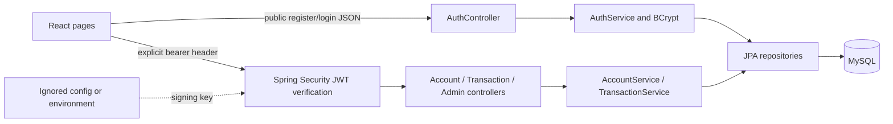
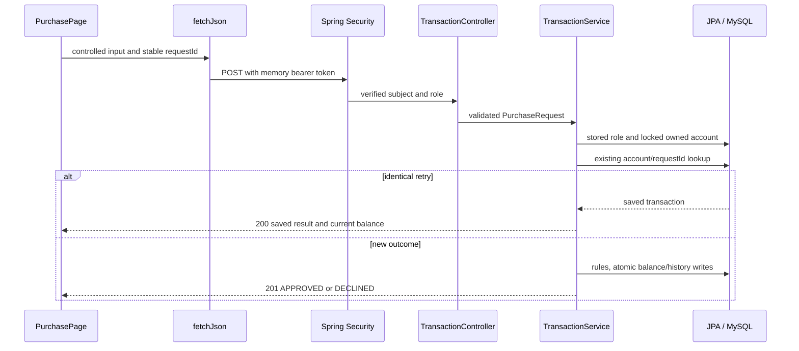

# System architecture

Credit Circuit is a local React application calling one Spring Boot API and one MySQL database. I kept the class banking app's familiar controller/service/repository flow and wrote the simulator's own rules.

React owns controlled fields, loading/errors, confirmations, and memory-only access. fetchJson adds Authorization and expires UI access on a protected 401. Context shares safe identity. The server authorizes and calculates balances.

Spring Security verifies HS256 signature/algorithm, expiry, issuer, exact audience, numeric subject, role, and issue/expiry claims. Public register/login and USER/ADMIN routes are explicit. No login session or authentication cookie is accepted. CORS allows local origins without credentials. Authentication has a bounded ten-attempt/minute limit per IP/process. The [authentication ADR](../04_Decisions/01_Authentication.md) explains CSRF and logout limits.

Controllers validate request shape/page bounds and call services directly. AuthService atomically creates user/account/card and checks BCrypt. AccountService handles role/ownership/summaries. TransactionService handles purchases/refunds/history. Repositories query rows and lock accounts. MySQL enforces foreign keys, allowed values, balance bounds, and uniqueness.

Balance/history share a transaction. READ_COMMITTED and pessimistic account locks protect concurrent changes/retries. Response DTOs expose safe fields inside service transactions rather than lazy entities or password hashes. No cascade deletes financial history. Four tables remain sufficient.

The [local run guide](../05_Submission/01_Local_Run_and_Demo.md) replaces waived AWS deployment instructions. No cloud infrastructure, pipeline, cloud monitoring, Jira, or branch-protection change belongs to this implementation.
