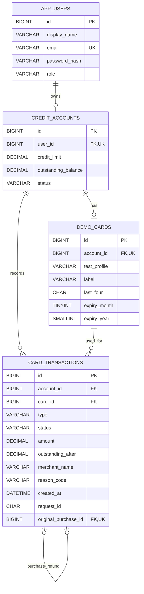

# Entity-Relationship Diagram

**Credit Card Transaction Simulator** 
**October 6, 2026**

## Data model

I kept the same basic shape as the banking application we used in class: a user owns an account, and the account has transactions. This project adds a fictional card for the purchase form and a link between a refund and its original purchase. The four tables have separate jobs, so account balances, card display details, and transaction history do not get mixed together.

Each customer has one credit account and one fictional card. An admin has no credit account. An account can have many transactions. A refund transaction points to one original purchase; an approved purchase can have at most one full refund.

## Tables and fields

### `app_users`

| Field | MySQL type | Rules | Purpose |
| --- | --- | --- | --- |
| `id` | `BIGINT` | Primary key, auto increment | User identifier. |
| `display_name` | `VARCHAR(100)` | Required | Name shown in the interface. |
| `email` | `VARCHAR(150)` | Required, unique | Login name. |
| `password_hash` | `VARCHAR(100)` | Required | BCrypt hash; never returned by the API. |
| `role` | `VARCHAR(20)` | Required; `USER` or `ADMIN` | Access level. |

Planned registration creates a USER, its credit account, and its demo card together and cannot assign the ADMIN role. ADMIN users are seeded for the demonstration.

### `credit_accounts`

| Field | MySQL type | Rules | Purpose |
| --- | --- | --- | --- |
| `id` | `BIGINT` | Primary key, auto increment | Credit account identifier. |
| `user_id` | `BIGINT` | Required, unique foreign key → `app_users.id` | Account owner; unique because each customer has one account. |
| `credit_limit` | `DECIMAL(14,2)` | Required, greater than zero | Maximum simulated credit. |
| `outstanding_balance` | `DECIMAL(14,2)` | Required, defaults to `0.00`; between zero and `credit_limit` | Amount owed after approved purchases and refunds. |
| `status` | `VARCHAR(20)` | Required; `ACTIVE` or `FROZEN` | Whether new purchases are allowed. |

`available_credit` is calculated as `credit_limit - outstanding_balance`. It is not stored as another column, so it cannot drift out of sync with the balance.

### `demo_cards`

| Field | MySQL type | Rules | Purpose |
| --- | --- | --- | --- |
| `id` | `BIGINT` | Primary key, auto increment | Fictional card identifier. |
| `account_id` | `BIGINT` | Required, unique foreign key → `credit_accounts.id` | Account that owns the card. |
| `test_profile` | `VARCHAR(20)` | Required | Name of a predefined fictional test number in the application. Different customers may use the same test profile. |
| `label` | `VARCHAR(50)` | Required | Name shown on the card, such as “Demo Card.” |
| `last_four` | `CHAR(4)` | Required, four digits | Masked display and a check against the selected test profile. |
| `expiry_month` | `TINYINT` | Required, 1–12 | Fictional expiration month. |
| `expiry_year` | `SMALLINT` | Required | Fictional expiration year. |

The full fictional number is mapped from `test_profile` in the application’s small test-number allowlist, rather than stored in MySQL. A customer can enter only the assigned test number. The test security code is checked for format during a request and is never stored.

### `card_transactions`

| Field | MySQL type | Rules | Purpose |
| --- | --- | --- | --- |
| `id` | `BIGINT` | Primary key, auto increment | Transaction identifier. |
| `account_id` | `BIGINT` | Required foreign key → `credit_accounts.id` | Account affected by the purchase or refund. |
| `card_id` | `BIGINT` | Required foreign key → `demo_cards.id` | Card used for the original purchase. The refund keeps the same card reference. |
| `type` | `VARCHAR(20)` | Required; `PURCHASE` or `REFUND` | Kind of transaction. |
| `status` | `VARCHAR(20)` | Required; `APPROVED` or `DECLINED` | Outcome. |
| `amount` | `DECIMAL(14,2)` | Required, greater than zero | Purchase or full-refund amount. |
| `outstanding_after` | `DECIMAL(14,2)` | Required, between zero and account limit | Account balance after this transaction. |
| `merchant_name` | `VARCHAR(100)` | Required | Fictional merchant label. A refund carries the original merchant. |
| `reason_code` | `VARCHAR(40)` | Optional | Non-sensitive explanation for a decline. |
| `created_at` | `DATETIME(6)` | Required, stored in UTC | Time of the outcome. |
| `request_id` | `CHAR(36)` | Required; unique with `account_id` | Identifies one submission so a retry cannot create another purchase. |
| `original_purchase_id` | `BIGINT` | Optional foreign key → `card_transactions.id`; unique | Links a refund to its purchase. Null for purchases. |

The history is append-only in normal use. An approved purchase remains in the table after a refund; the linked REFUND row shows what reversed it. A declined purchase keeps the account's previous `outstanding_after` value. An expired assigned card, frozen account, or insufficient credit produces a decline. Malformed or mismatched input creates no transaction. Timestamps are UTC; the simpler service writes whole seconds into the existing DATETIME(6) column.

## Relationships and constraints

| Relationship | Cardinality | How it is enforced |
| --- | --- | --- |
| User → credit account | One user to zero or one account | `credit_accounts.user_id` foreign key and unique constraint. ADMIN users have no account. |
| Credit account → demo card | One account to zero or one card | `demo_cards.account_id` foreign key and unique constraint. Registration creates both together. |
| Credit account → transactions | One account to many transactions | `card_transactions.account_id` foreign key and account/history index. |
| Demo card → transactions | One card to many transactions | `card_transactions.card_id` foreign key. The service also checks that card and transaction belong to the same account. |
| Purchase → refund | One approved purchase to zero or one full refund | `original_purchase_id` self-reference and unique constraint, plus service checks on type, status, owner, and amount. |

MySQL checks restrict roles and statuses and prevent negative balances or nonpositive transaction amounts. An index on `(account_id, id)` supports newest-first account history. A unique index on `(account_id, request_id)` supports duplicate-submission protection. Services lock the account during purchases, refunds, and status changes and check the cross-row rules. Balance and history commit together. A full refund remains eligible on a frozen account.

Java entities follow the foreign keys in one direction. The ERD still describes the database relationships; it does not require reverse Java fields or transaction collections. Repository queries retrieve accounts, cards, and history as needed.

## Balance examples

If the credit limit is **$1,000.00** and the outstanding balance is **$200.00**, available credit is **$800.00**. An approved **$50.00** purchase changes the outstanding balance to **$250.00** and records `outstanding_after = 250.00`. A declined **$900.00** purchase records the decline but leaves the outstanding balance at **$250.00**. A full refund of the approved $50.00 purchase creates a linked REFUND row and returns the outstanding balance to **$200.00**.

The October 8 simplification keeps this SQL schema unchanged. Input rules live in services and table constraints remain in SQL; entities only map stored fields/relationships. Pagination and API formatting helpers are removed, and response money uses JSON numbers backed by Java BigDecimal.
