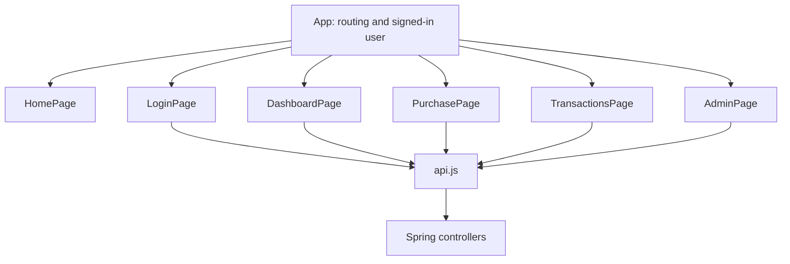

# React plan — keep each page simple

Updated October 8, 2026. The current frontend follows `main.jsx` → `App.jsx` → `pages/HomePage.jsx`. `main.jsx` imports `styles.css`. Vite forwards `/api` to Spring Boot on port 8080.

The home page is a static transaction workbench with a sample account, purchase decision, and history list. Its charcoal decision panel and lime available-credit figure are the focal point. A labeled $125.00 sample purchase reduces available credit from $1,500.00 to $1,375.00 and raises outstanding balance from $500.00 to $625.00 under a $2,000.00 limit. A proportional bar shows how that limit is split after the purchase; the newest history record shows the same purchase and resulting balance.

All preview values are fixed fictional content in `HomePage.jsx`. The page makes no API calls and has no sign-in or transaction controls. Plain CSS places the introduction beside the workbench on wide screens and stacks the panels and labeled history records on phones. There is no animation or interactive card.

The planned path is a page calling one small fetch helper:

| Page | Local state and job |
| --- | --- |
| Home | Introduce the simulator with a labeled sample account, purchase decision, credit change, and history |
| Login | Registration/sign-in fields, loading, and errors |
| Dashboard | Account summary and masked card |
| Purchase | Eight input fields, one request ID per submission, loading, and returned outcome |
| Transactions | History array and full-refund action |
| Admin | Account/activity arrays and ACTIVE/FROZEN controls |

The planned pages use ordinary `useState` and props. `App` will own the signed-in user's display information. A server session cookie will identify API requests after sign-in is implemented; there is no JWT state or browser password store. Sign-in will include CSRF protection before it is enabled.

The planned API helper calls `fetch` and reads `message` on an HTTP error. Each page keeps its own fields, form, result, and table until reuse requires a separate component. History is an array without paging. Response money values are displayed with two decimal places; all approval/refund math stays in Java. A successful HTTP 200 may contain a DECLINED financial result.

The purchase page will use a normal labeled HTML form. Card animation, context providers, layout abstractions, caching libraries, generic table/form engines, and global state libraries are outside this MVP. Authentication and these page implementations remain later numbered sections.
