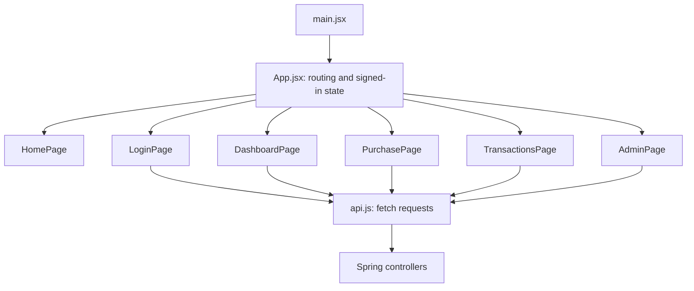

# React component plan — the MVP

Updated October 7, 2026 after instructor feedback.

The current frontend is `main.jsx` → `App.jsx` → `pages/HomePage.jsx`, with `styles.css`. It is a public home page and makes no API calls yet. Vite forwards `/api` to Spring Boot at `http://localhost:8080`; see the [frontend setup](../../frontend/README.md).

## Planned structure

Use plain React `useState`, ordinary props, and React Router when routes are implemented. `App` owns the signed-in user and JWT in memory and passes them to pages. Refreshing requires sign-in again. An authentication context, layout framework, data cache, and global state library are unnecessary for this small application.

| Planned route | Page responsibility and local state |
| --- | --- |
| `/` | `HomePage`: describe the fictional simulation and link to sign-in. |
| `/login` | `LoginPage`: registration/sign-in fields, loading state, and errors. |
| `/dashboard` | `DashboardPage`: account summary and masked card. |
| `/purchase` | `PurchasePage`: eight input fields, one request ID per attempted purchase, loading/error state, and the returned result. Reuse that ID for an uncertain retry. |
| `/transactions` | `TransactionsPage`: history page number, rows, and full-refund action with a `requestId` query parameter. |
| `/admin` | `AdminPage`: account/activity lists and ACTIVE/FROZEN status controls using a `status` query parameter. |

Each page calls a small `api.js` helper using `fetch`. That helper sends requests, adds the JWT header, and reads safe API errors. It contains no purchase/refund decisions. Server role and ownership checks enforce access; frontend route checks only guide navigation.

Keep forms, result displays, and tables in their page files until something actually needs reuse. Do not create every form field/button as a separate component. The customer form remains ordinary labeled HTML inputs. Card animation is deferred polish after all MVP workflows work; it is not part of the purchase decision or an extra service.

The remaining planned files are `api/api.js` and the five unfinished page files listed above. Their implementation is a later numbered section, after backend authentication. No additional frontend code was added during the backend simplification.
