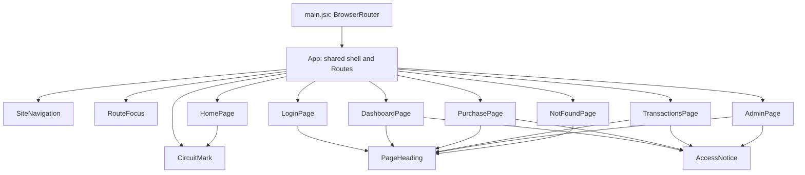

# Credit Circuit — React components

Updated October 8, 2026.

I use one Vite application with JavaScript and JSX. `main.jsx` imports the stylesheet, creates the React root, and wraps `App` in `BrowserRouter`. `App` keeps the header, navigation, routes, and footer in one place. Each page has one main content area and a clear job.

## Current pages

| Route | Component | What it shows now |
| --- | --- | --- |
| `/` | `HomePage` | Wordmark, fictional display card, and Request → Checks → Outcome teaser. |
| `/login` | `LoginPage` | Sign-in is still being built; a link returns home. |
| `/dashboard` | `DashboardPage` | Account heading and an access-unavailable notice. |
| `/purchase` | `PurchasePage` | Purchase heading and an access-unavailable notice. |
| `/transactions` | `TransactionsPage` | History heading and an access-unavailable notice. |
| `/admin` | `AdminPage` | Administration heading and an access-unavailable notice. |
| Any other path | `NotFoundPage` | Page-not-found message and a link home. |

I kept the opening screen's dark background, lime accents, large wordmark, thin signal traces, and pale fictional card. The display card shows only a masked ending and a fictional-card label. The introduction sits beside it on desktop and above it on phones. The other pages use the same colors and typography, with a simple bordered notice panel.

The four protected pages show their purpose without presenting a signed-in account. There are no balances, sample transactions, credential fields, purchase forms, refunds, or account-status controls. The pages make no API calls and own no account state yet. The visible navigation links are page destinations; they do not grant account access.

## Shared pieces

| Component | Job and props |
| --- | --- |
| `SiteNavigation` | Six explicit `NavLink` links with the current page marked. No props. |
| `PageHeading` | Display `eyebrow`, `title`, and `description`, all required strings. |
| `AccessNotice` | Display the common access-unavailable message and link to `/login`. Required `children` supplies the page's explanation. |
| `CircuitMark` | Draw the decorative SVG mark in the header and on the home card. No props. |
| `RouteFocus` | Update the browser title, move focus to the main content after a route change, and return to the top. No props or visible UI. |

`App` has the shared header and footer directly in its JSX. I kept each page's main content explicit rather than adding a layout wrapper. The navigation wraps on small screens. Keyboard users can see link focus, skip the header, and reach the page content after navigation. The initial page load keeps the normal tab order.

The two components that accept props define them in JSDoc comments. `AccessNotice` accepts React content as `children`; `PageHeading` accepts three strings. `npm run check:props` runs the JavaScript checker through `jsconfig.json` and checks the page callers too. The files remain JSX. There is no generic form or table system.

## Remaining behavior

Registration and sign-in still need implementation. Sign-in will check a BCrypt password and establish a server session. The browser will carry the session cookie, with CSRF protection included before browser sign-in is enabled. There is no JWT state or browser password store. `AccessNotice` describes unavailable functionality; it is not an authorization check. Future account access still requires server role and ownership checks.

| Page | Planned behavior after secure sign-in |
| --- | --- |
| Login | Registration/sign-in fields, loading, errors, and session handling. |
| Dashboard | Own account summary and masked fictional card. |
| Purchase | A labeled form with eight request fields, one request ID per submission, loading, and the returned outcome. |
| Transactions | A newest-first history array and one full-refund action for an eligible purchase. |
| Admin | Account/activity arrays and ACTIVE/FROZEN controls for an administrator. |

Each page will own its fields, results, and ordinary `useState` values. A small API helper will call `fetch` and read the server's `message` on an HTTP error. History and admin lists will remain plain arrays without paging. A shared safe response shape can serve customer and admin views. Reusable UI will be extracted when more than one page needs it.

The [API design](03_API_Design.md) defines the planned request and response fields. Money will display with two decimal places, while approval/refund math stays in Java. A successful HTTP 200 may contain a DECLINED financial result. Ownership, role checks, duplicate request IDs, full-refund rules, and all-or-nothing balance/history writes stay on the server.

Card animation, global state libraries, caching layers, and generic form/table engines are outside this MVP.

## Verification

`npm run build`, `npm run check:props`, and all 13 `npm run check:routes` checks passed. The route checks render the real JSX with a memory router and cover matching, current links, the fallback, home labels, and unavailable pages without banking controls.

I also checked the production preview in the browser at 1440 × 900, 390 × 844, and 320 × 844. All six direct URLs and refresh worked, along with an unknown nested route and its home link. Every page fit both phone widths. Tab, Shift+Tab, Enter, the skip link, visible focus, route-change focus, page titles, and browser back/forward worked. Local Vite serves the frontend fallback; a deployed server would also need to return `index.html` for frontend routes.
