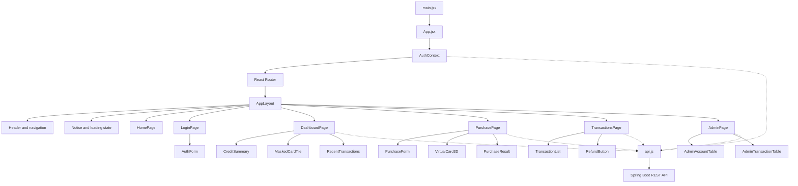

# React Component Diagram

**Credit Card Transaction Simulator**<br>
**October 6, 2026**

## Overview

The planned frontend is one React application. `App` sets up routing and the signed-in user. Each page owns the data and form state it needs, while a small API helper handles requests to Spring Boot. This follows the layout of the banking app we used in class: pages and small components call an API helper, and the backend remains responsible for account rules.

The virtual card is part of the purchase page. It previews masked test-card details and flips when the user presses a button. It does not replace the normal form or make its own API calls.

## Component hierarchy



The dotted lines represent API calls. The other arrows show which component renders another component. The route checks in React keep the interface clear, but Spring Security and service ownership checks make the actual access decision.

## Routes and page responsibilities

| Route | Access | Page | Main responsibility |
| --- | --- | --- | --- |
| `/` | Public | `HomePage` | Explain the fictional simulation and link to sign-in. |
| `/login` | Public | `LoginPage` | Register or sign in through `AuthForm`. |
| `/dashboard` | USER | `DashboardPage` | Show credit limit, outstanding balance, available credit, masked card, and recent activity. |
| `/purchase` | USER | `PurchasePage` | Collect test card details, show the 3D preview, submit a purchase, and display its outcome. |
| `/transactions` | USER | `TransactionsPage` | Show paginated history and request an eligible full refund. |
| `/admin` | ADMIN | `AdminPage` | Review account and transaction summaries; freeze or reactivate accounts. |

`AppLayout` renders the header, navigation, and shared notices. A small protected-route component directs signed-out users to `/login` and keeps USER pages separate from the ADMIN page. API responses still determine what the user may actually access.

## State and data flow

| State | Owner | Why it lives there |
| --- | --- | --- |
| Signed-in user and JWT | `AuthContext` | The header, protected routes, and API helper all need the same login state. The token is kept in memory and cleared on sign-out. |
| Account summary and recent activity | `DashboardPage` | Only the dashboard needs these values. It loads them when the page opens and after a successful purchase or refund. |
| Purchase fields, card flip, request ID, and result | `PurchasePage` | The form and 3D card need the same local state. One request ID is created for a submission and reused if that request is retried. |
| History page number and refund result | `TransactionsPage` | Pagination and refund controls are specific to the history view. |
| Admin account and transaction lists | `AdminPage` | Only admins use these lists and status controls. |

The purchase form uses controlled inputs. `PurchasePage` passes only a card label, masked last four digits, expiry, and flip state to `VirtualCard3D`. The test security code stays in the form field and is never passed to the model. If WebGL is unavailable or reduced motion is requested, the same HTML form remains usable.

The API helper sends JSON, adds the JWT to protected requests, and turns HTTP errors into readable messages. It does not contain purchase rules. For example, a `DECLINED` transaction is a successful API response with a declined outcome, while a malformed form submission is an error response.

## Planned frontend files

```text
frontend/
  src/
    main.jsx
    App.jsx
    api.js
    auth/
      AuthContext.jsx
    pages/
      HomePage.jsx
      LoginPage.jsx
      DashboardPage.jsx
      PurchasePage.jsx
      TransactionsPage.jsx
      AdminPage.jsx
    components/
      AppLayout.jsx
      AuthForm.jsx
      CreditSummary.jsx
      MaskedCardTile.jsx
      PurchaseForm.jsx
      VirtualCard3D.jsx
      PurchaseResult.jsx
      TransactionList.jsx
      AdminAccountTable.jsx
      AdminTransactionTable.jsx
    styles.css
```

Small pieces stay in their page file. Shared components have their own files. Each page uses plain React state; the design has one frontend and no separate 3D service.
