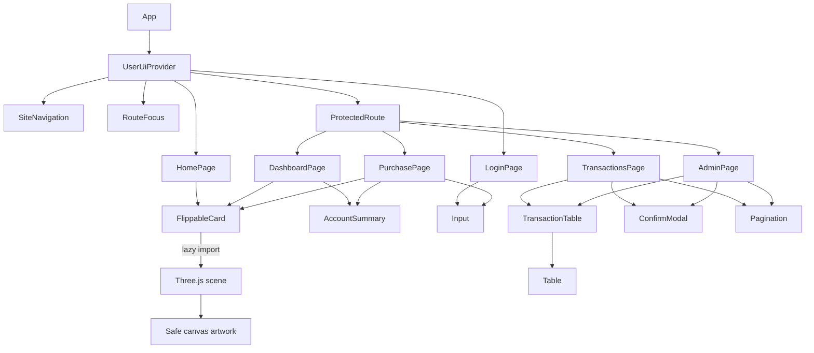

# React component design

Button supplies pending/disabled feedback, Input connects labels/errors with useId, Card provides section headings, Table provides caption/headers and a focusable scroll region, ConfirmModal uses native dialog, and Loading supplies a spinner/skeleton. FlippableCard uses local state for side, model availability, reveal visibility, and a temporary sample security code; a ref holds the graphics scene. An effect lazily imports cardScene, which creates the extruded Three.js card. The owned dashboard card can reveal its derived fictional number on the front and sample code on the back. A timer and blur/visibility listeners hide details after 20 seconds or focus loss. Hiding replaces the face textures immediately and clears old pixels; unmount releases graphics resources. Home is always masked. ACTIVE/FROZEN account props control the badge and muted appearance. The accessible text summary and revealed text stay outside the decorative canvas. A failed graphics download or lost context keeps the HTML/CSS fallback usable. Reduced motion stops shimmer/tilt and flips immediately.

Dashboard's Use this card link sends only `/purchase?useCard=1`. PurchasePage uses fictionalCardNumber to follow the existing owned card's entry instruction and verify its mask, then prefills number/expiry once in React memory. Legacy cards remain supported; unknown instructions fail closed. No full number or code goes in navigation state, browser storage, database rows, logs, or saved screenshots. The API still returns the same masked fields. Form entry and backend purchase rules remain independent of model interaction.

| React item | Use and reason |
| --- | --- |
| useState | Controlled forms, page/data/errors/pending/selected confirmation. |
| useEffect | API loading, stale-update cleanup, navigation/resize, expiration. |
| Context | Share safe user state and actions with pages/navigation. |
| useReducer | signedIn/signedOut/expired transitions keep user/expiration/notice consistent. |
| useCallback | Stable auth handlers avoid repeatedly configuring token readers/expiry effects. |
| useMemo | Memoized Context value avoids a new shared identity object on unrelated renders. |
| useRef | Memory token, in-flight guard, stable uncertain request, dialog/focus elements. |
| JSX/JSDoc | Ordinary JSX with checked prop/DTO shapes. |

Pages call API functions directly. fetchJson attaches protected bearer headers and omits cookies; protected 401 responses expire UI identity. Route guards redirect signed-out users/restrict wrong roles, while services enforce actual permissions.

## Responsibilities

Pages own their form values, request state, and event handlers. They call named functions in creditCircuitApi rather than building fetch requests. fetchJson handles HTTP, token attachment, JSON parsing, and safe errors. UserUiContext owns the token and sign-in transitions; it supplies a token reader and expiration callback to fetchJson.

Shared components receive data and callbacks through props. ConfirmModal manages its dialog and focus, while its page decides which refund or status change to request. AccountSummary and TransactionTable display API data. format.js provides currency and reason-label formatting, and types.js describes shared JSON shapes for JSDoc checks. Neither file makes requests. These two small files currently live beside the API modules because the pages share them.

Page components contain both JSX and the local interaction logic for their workflow. This keeps each page readable in one file. Financial rules and database access remain on the backend.

Purchase/refund actions keep the original UUID while uncertain and guard repeated clicks. Declines are saved results. Forms have labeled errors/loading/recovery. Dialogs focus Cancel, support Escape, and restore focus. Lists show empty states and bounded navigation. Wide tables scroll within a keyboard-focusable region.

[Browser evidence](../03_Verification/browser-results.json) distinguishes real MySQL workflows from injected lost responses, expiration, failures, and empty states. It checks desktop/tablet/phone widths, keyboard focus/navigation, and automated accessibility rules. It does not replace personal screen-reader or cross-browser review.
