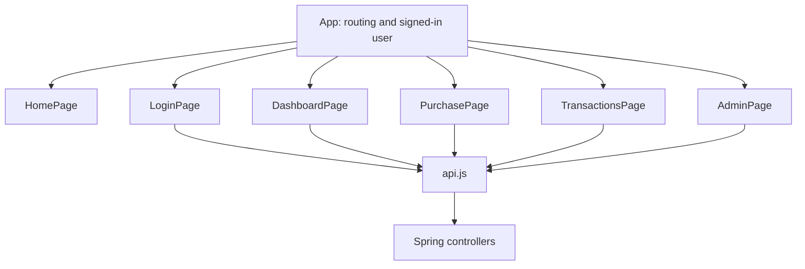

# React plan — keep each page simple

Updated October 8, 2026. Today only main.jsx → App.jsx → HomePage.jsx and styles.css are implemented. The home page makes no API calls. Vite forwards `/api` to Spring Boot on port 8080.

The planned path is a page calling one small fetch helper:

| Page | Local state and job |
| --- | --- |
| Home | Explain the fictional simulation and link to sign-in |
| Login | Registration/sign-in fields, loading, and errors |
| Dashboard | Account summary and masked card |
| Purchase | Eight input fields, one request ID per submission, loading, and returned outcome |
| Transactions | History array and full-refund action |
| Admin | Account/activity arrays and ACTIVE/FROZEN controls |

Use ordinary useState and props. App owns the signed-in user's display information. A server session cookie will identify API requests after sign-in is implemented; there is no JWT state or browser password store. Sign-in must include CSRF protection before it is enabled.

The API helper calls fetch and reads `message` on an HTTP error. Each page keeps its own fields, form, result, and table until reuse actually requires a separate component. History is an array without paging. Display response money numbers with two decimal places; all approval/refund math stays in Java. A successful HTTP 200 may contain a DECLINED financial result.

Keep the normal labeled HTML purchase form. Card animation, context providers, layout abstractions, caching libraries, generic table/form engines, and global state libraries are outside this MVP. Authentication and these page implementations remain later numbered sections.
