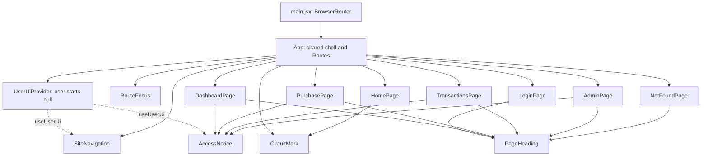

# Credit Circuit — React components

Updated October 8, 2026.

I use one Vite application with JavaScript and JSX. `main.jsx` imports the stylesheet, creates the React root, and wraps `App` in `BrowserRouter`. `App` keeps the header, navigation, routes, and footer in one place, inside `UserUiProvider`. Each page has one main content area and a clear job.

## Current pages

| Route | Component | What it shows now |
| --- | --- | --- |
| `/` | `HomePage` | Wordmark, fictional display card, and Request → Checks → Outcome teaser. |
| `/login` | `LoginPage` | Sign-in is still being built; a link returns home. |
| `/dashboard` | `DashboardPage` | Account heading and an access-unavailable notice. |
| `/purchase` | `PurchasePage` | Purchase heading and an access-unavailable notice. |
| `/transactions` | `TransactionsPage` | History heading and an access-unavailable notice. |
| `/admin` | `AdminPage` | Administration heading and an access-unavailable notice. |
| Any other path | `NotFoundPage` | Page-not-found message and a link home. |

I kept the opening screen's dark background, lime accents, large wordmark, thin signal traces, and pale fictional card. The display card shows only a masked ending and a fictional-card label. The introduction sits beside it on desktop and above it on phones and portrait tablets. The other pages use the same colors and typography, with a simple bordered notice panel. Sign-in and the four protected pages share the label “Access unavailable.”

Long text can wrap without widening the page. The card stage uses a grid column that can shrink, the emblem stays within its available width, and the card heading and footer can wrap when text is enlarged. The home screen still stops at Request → Checks → Outcome, without showing a completed purchase, an amount, a balance change, or history.

The four protected pages show their purpose without presenting a signed-in account. There are no balances, sample transactions, credential fields, purchase forms, refunds, or account-status controls. The pages make no API calls and own no account state yet. The visible navigation links are page destinations; they do not grant account access.

## Shared pieces

| Component | Job and props |
| --- | --- |
| `SiteNavigation` | Six explicit `NavLink` links, current-page marking, shared user status, and a local phone menu. No props. |
| `UserUiProvider` | Hold safe user details in memory, starting with `null`. Required `children` contains the app. |
| `PageHeading` | Display `eyebrow`, `title`, and `description`, all required strings. |
| `AccessNotice` | Keep account tools unavailable and show a sign-in link while anonymous. Required `children` supplies the page's explanation. |
| `CircuitMark` | Draw the decorative SVG mark in the header and on the home card. No props. |
| `RouteFocus` | Update the browser title, move focus to the main content after a route change, and return to the top. No props or visible UI. |

`App` has the shared header and footer directly in its JSX. I kept each page's main content explicit rather than adding a layout wrapper. The navigation shows all six destinations on desktop. At 50rem and below, a Menu button opens the same links in a compact area under the header. Keyboard users can see link, button, and content focus, skip the header, and reach the page content after navigation. The initial page load keeps the normal tab order.

Each route has one main area, one top-level heading, and its own browser title. Notice sections are labeled by their headings. Decorative SVGs and card bullets are hidden from assistive technology; the masked ending has readable text saying “Card ending in 4242.” That text avoids an unsupported paragraph name under the [ARIA naming rules](https://www.w3.org/TR/html-aria/). The menu uses a normal button and ordinary links in reading order.

The components that accept props define them in JSDoc comments. `AccessNotice` and `UserUiProvider` accept React content as `children`; `PageHeading` accepts three strings. `npm run check:props` runs the JavaScript checker through `jsconfig.json` and checks the page callers and user-state types too. The files remain JSX. There is no generic form or table system.

## State in the interface

I keep one shared value in `auth/UserUiContext.jsx`: `user`, initially `null`. `UserUiProvider` uses `useState`, and `useUserUi` reads it with `useContext`. Navigation and `AccessNotice` use that same value, so they agree about the displayed sign-in status. All six navigation links remain page destinations, including for an anonymous visitor. Opening a protected URL keeps its heading and access-unavailable notice; it does not redirect to a working login or show account tools.

`SiteNavigation` owns one local `useState` value, `isMenuOpen`. One effect closes the menu when the route changes, including browser back/forward. An Escape listener runs while the menu is open. A separate viewport listener stays active while navigation is mounted, so it also handles resizing with a closed menu. Refs identify the button and navigation. If a resize hides a focused desktop link, focus moves to Menu. If it hides the focused Menu button, focus moves to the first desktop link. A blur handler covers browsers that hide the control before the viewport listener runs. Content focus stays where it is. Switching to desktop also closes the menu, and unmounting removes the listeners.

Escape or selecting the current page returns focus to the button. Selecting a different page closes the menu and lets `RouteFocus` move focus to the content. The closed phone menu is hidden from both display and keyboard navigation. Its button reports `aria-expanded` and `aria-controls`; the links do not need a focus trap.

The state transitions are simple assignments and one menu toggle, so I do not use `useReducer`. There is no expensive calculation or measured rendering issue that needs `useMemo` or `useCallback`; the event handlers are ordinary functions. I will reconsider those hooks if a later workflow needs them.

## API functions

I put eight named functions in `frontend/src/api/creditCircuitApi.js`: `getAccounts`, `getCards`, `submitPurchase`, `getTransactions`, `refundPurchase`, `getAdminAccounts`, `getAdminTransactions`, and `updateAccountStatus`. Each calls the small `fetchJson` helper with its relative `/api` path and method. The pages do not call these functions yet, so the component diagram still shows the unavailable interface.

Purchases send the eight fields from the API design as one JSON body. The caller supplies the request ID, and the helper preserves it and the amount's string or number type. A purchase page will keep the same submission for an uncertain retry. Full refunds use POST with `?requestId=<UUID>` and no body or refund amount. Admin status changes use PATCH with `?status=ACTIVE` or `?status=FROZEN` and no body. Both query values are URL-encoded.

HTTP errors become an `Error` containing the server's safe `message`. A missing or invalid message, unreadable error response, or message repeating submitted card secrets uses an HTTP-status fallback. Network failures and unreadable successful JSON have clear messages. The helper does not log requests/responses or attach raw bodies and failure details to errors. It does not generate request IDs, use browser token storage, or add a bearer token.

## Remaining behavior

| Page | Planned behavior after secure sign-in |
| --- | --- |
| Login | Labeled registration/sign-in fields, validation, loading, errors, and session handling. |
| Dashboard | Own account summary and masked fictional card. |
| Purchase | A labeled form with eight request fields, validation, one request ID per submission, loading, and the returned outcome. |
| Transactions | A newest-first history array and one full-refund action for an eligible purchase. |
| Admin | Account/activity arrays and ACTIVE/FROZEN controls for an administrator. |

Form validation remains pending for registration, sign-in, and fictional purchases, including specific errors beside labeled fields. Loading feedback remains pending for sign-in, account/card reads, purchases, history/admin lists, refunds, and status changes. Pending submissions will need to prevent a second action while the first request is running. The current pages have no forms or requests, so these states are not implemented yet.

The [API design](03_API_Design.md) defines the current endpoint fields and the remaining sign-in work. Money will display with two decimal places, while approval/refund math stays in Java. A successful HTTP 200 may contain a DECLINED financial result. Ownership, role checks, duplicate request IDs, full-refund rules, and all-or-nothing balance/history writes stay on the server.

## Verification

`npm run build`, `npm run check:props`, all 13 `npm run check:routes` checks, all 10 `npm run check:state` checks, and all 33 `npm run check:api` checks passed. The route checks render the real JSX with a memory router and cover matching, current links, anonymous status, the fallback, the readable card ending, the home teaser without a purchase result, and consistent unavailable notices without banking controls. The state checks mount the real components in JSDOM with React StrictMode. They cover direct page loads, shared UI updates without unlocking tools, anonymous remounts, blocked browser storage, link navigation, menu toggling, Escape focus, same-page selection, route changes, back/forward, focus handoffs on resize and early CSS blur, and listener cleanup. Every state check also verifies that no API request occurs. JSDOM is a development dependency and does not test CSS layout.

I visually checked every route and an unknown nested route in the production preview at 1440 × 900, 768 × 1024, and 320 × 844. I also checked 390 × 844 and open tablet/phone menus. Direct URLs and refresh worked. All pages and open menus fit without horizontal scrolling. With the preview's root text temporarily doubled from 16px to 32px at 320px wide, every route and open menu still fit; headings and card labels wrapped and the card stayed in its column. I restored normal text afterward.

Tab, Shift+Tab, Enter, Space, Escape, the skip link, visible focus, route-change focus, page titles, and browser back/forward worked. Resizing across the 50rem breakpoint kept focus on visible navigation and left content focus alone. The browser accessibility tree exposed headings, menu state, notice labels, and the readable card ending. Measured text contrast was at least 4.99:1. The frontend source review found no protected page-load requests, browser storage, sensitive display values, or console logging. UI context still cannot authorize requests or unlock account tools.

The [frontend README](../../frontend/README.md) has the local setup and commands. Vite development and preview serve the frontend fallback; a deployed server would also need to return `index.html` for frontend routes and forward `/api` separately.

## Scope correction - October 8, 2026

The instructor waived AWS and related deployment/DevOps work. Jira and branch protection are outside this completion pass. JWT authentication, BCrypt, validation, pagination, OpenAPI, authentication rate limiting, coverage, Postman, and SonarQube remain required. Java coverage must meet 70%; the Excellent target is 80%+. The 3D card remains planned after the required application works. Presentation rehearsal is October 12; presentation and submission are October 13.

The older session-only implementation is being replaced by one signed JWT approach with tokens in React memory. Required work and evidence are tracked in [the completion checklist](../03_Verification/01_Completion_Checklist.md).
