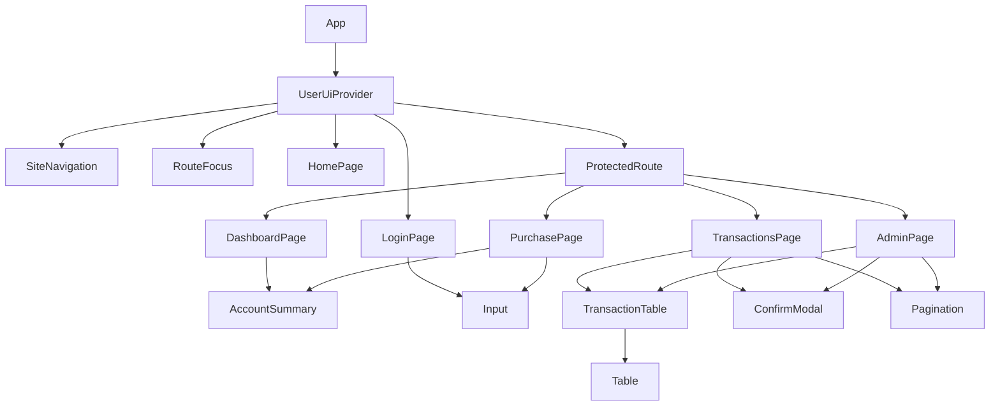

# React component design

Button supplies pending/disabled feedback, Input connects labels/errors with useId, Card provides section headings, Table provides caption/headers and a focusable scroll region, ConfirmModal uses native dialog, and Loading supplies a spinner/skeleton. These small pieces serve current workflows. Home retains its visual teaser. The future 3D card remains planned.

| React item | Use and reason |
| --- | --- |
| useState | Controlled forms, page/data/errors/pending/selected confirmation. |
| useEffect | API loading, stale-update cleanup, navigation/resize, expiration. |
| Context | Share safe user state and actions with pages/navigation. |
| useReducer | signedIn/signedOut/expired transitions keep user/expiration/notice consistent. |
| useCallback | Stable auth handlers avoid repeatedly configuring token readers/expiry effects. |
| useMemo | Memoized Context value avoids a new shared identity object on unrelated renders. |
| useRef | Memory token, in-flight guard, stable uncertain request, dialog/focus elements. |
| JSX/JSDoc | Ordinary JSX with checked prop/DTO shapes. |

Pages call API functions directly. fetchJson attaches protected bearer headers and omits cookies; protected 401 responses expire UI identity. Route guards redirect signed-out users/restrict wrong roles, while services enforce actual permissions.

Purchase/refund actions keep the original UUID while uncertain and guard repeated clicks. Declines are saved results. Forms have labeled errors/loading/recovery. Dialogs focus Cancel, support Escape, and restore focus. Lists show empty states and bounded navigation. Wide tables scroll within a keyboard-focusable region.

[Browser evidence](../03_Verification/browser-results.json) distinguishes real MySQL workflows from injected lost responses, expiration, failures, and empty states. It checks desktop/tablet/phone widths, keyboard focus/navigation, and automated accessibility rules. It does not replace personal screen-reader or cross-browser review.
