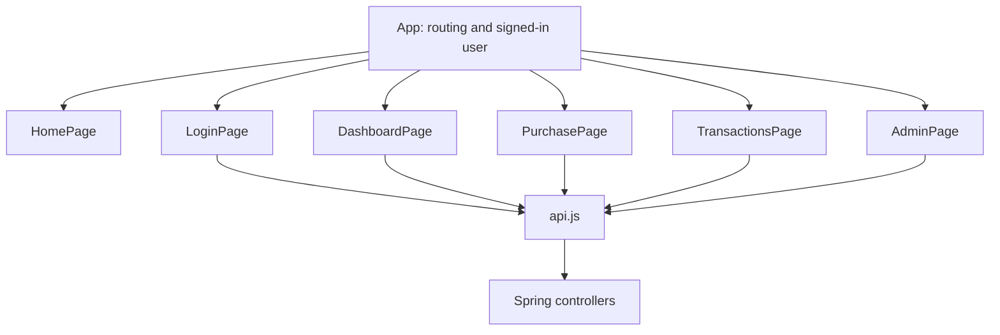

# React plan — keep each page simple

Updated October 8, 2026. The current Credit Circuit frontend follows `main.jsx` → `App.jsx` → `pages/HomePage.jsx`. `main.jsx` imports `styles.css`. `HomePage` uses `components/CircuitMark.jsx` for the shared SVG mark in the header and on the card. Vite forwards `/api` to Spring Boot on port 8080.

The home page introduces Credit Circuit while keeping Credit Card Transaction Simulator as the formal capstone description. A large wordmark and pale fictional card stand against a dark background with lime accents and thin signal traces. Request → Checks → Outcome is a teaser for the purchase flow. Amounts, approvals, balance changes, and history are reserved for the later screens.

The display card in `HomePage.jsx` shows only a masked ending and a fictional-card label. The page makes no API calls and has no sign-in or transaction controls. Plain CSS places the introduction beside the card on wide screens and above it on phones. There is no animation or interactive card.

The planned path is a page calling one small fetch helper:

| Page | Local state and job |
| --- | --- |
| Home | Introduce Credit Circuit with a fictional display card and a Request → Checks → Outcome teaser |
| Login | Registration/sign-in fields, loading, and errors |
| Dashboard | Account summary and masked card |
| Purchase | Eight input fields, one request ID per submission, loading, and returned outcome |
| Transactions | History array and full-refund action |
| Admin | Account/activity arrays and ACTIVE/FROZEN controls |

The planned pages use ordinary `useState` and props. `App` will own the signed-in user's display information. A server session cookie will identify API requests after sign-in is implemented; there is no JWT state or browser password store. Sign-in will include CSRF protection before it is enabled.

The planned API helper calls `fetch` and reads `message` on an HTTP error. Each page keeps its own fields, form, result, and table until reuse requires a separate component. History is an array without paging. Response money values are displayed with two decimal places; all approval/refund math stays in Java. A successful HTTP 200 may contain a DECLINED financial result.

The purchase page will use a normal labeled HTML form. Card animation, context providers, layout abstractions, caching libraries, generic table/form engines, and global state libraries are outside this MVP. Authentication and these page implementations remain later numbered sections.
