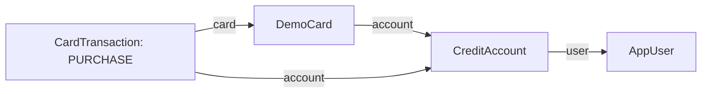

# How I explain the backend

## Purchase workflow, starting with the service

My purchase workflow starts with `TransactionService.purchase`. This method decides whether a purchase is approved, updates the account when it is approved, and saves the outcome in history. The controller and React page pass information in and display the result.

### The objects the service works with

| Object | What it represents | Relationship |
| --- | --- | --- |
| `AppUser` | The signed-in customer and stored role. | `CreditAccount.user` identifies the account owner. |
| `CreditAccount` | The credit limit, outstanding balance, and account status. | One customer owns one account. |
| `DemoCard` | The assigned fictional card and expiry. | `DemoCard.account` links the card to that account. |
| `CardTransaction` | A saved purchase or refund outcome. | Each transaction links to its account and the card used. |



These arrows follow the Java references. In MySQL, they become `user_id`, `account_id`, and `card_id` foreign keys. One account and one card can appear in many transaction rows. A new purchase has no `originalPurchase`; that relationship is set later on a refund row to identify the purchase being reversed.

### What purchase does, in order

1. **Check the customer and load the account.** `accountService.requireRole` checks the stored USER role. `lockOwnedAccount` searches by both account ID and user ID. It also locks that account so another balance-changing request waits its turn.
2. **Load and check the assigned card.** The card repository searches by card ID and account ID together. `validateAssignedCard` compares the full fictional number and entered expiry with the assigned card. The controller has already checked input format with Bean Validation. The security code is checked for format only; it is not stored or compared with a saved code.
3. **Check for an earlier submission.** The service looks up the account and normalized request ID. If the saved purchase has the same card, merchant, and amount, it returns that existing transaction. Changed details under the same request ID return a conflict. A replay does not change the balance or add history.
4. **Decide approval or decline.** The service checks expired card, frozen account, and insufficient available credit, in that order. Available credit is the credit limit minus the outstanding balance.
5. **Apply the decision.** An approval adds the purchase amount to the outstanding balance using `BigDecimal` and saves the account. A decline leaves the balance unchanged. Both outcomes create a `CardTransaction` with their status and any decline reason.
6. **Link and save the history row.** `fillTransactionHistory` sets the account, card, amount, merchant, request ID, UTC timestamp, and balance after the decision. The transaction repository saves the row. The method returns the transaction display data and current account together.

`checkRequestId` normalizes a valid UUID before the duplicate lookup. The request ID identifies a submission, while the account and card IDs identify stored records.

### Where the relationships are saved

Inside `fillTransactionHistory`, these two lines connect the purchase to the rows the service already checked:

```java
transaction.setAccount(customerAccount);
transaction.setCard(assignedCard);
```

JPA uses those references to write `account_id` and `card_id`. It does not create another customer, account, or card. The same helper records `outstandingAfter`, so history retains the balance at the time of that outcome even when later purchases change the current account balance.

The repositories handle database queries and saves. The service decides whether those saves should happen. MySQL foreign keys prevent a history row from pointing to a missing account or card.

### One $50 purchase

My example account has a $1,000 limit and $200 outstanding, so it has $800 available. With the matching unexpired card and an active account, a $50 purchase is approved. The account now has $250 outstanding and $750 available. The saved purchase records $50, APPROVED, and an `outstandingAfter` value of $250.

If I submit $900 instead, the service records an INSUFFICIENT_CREDIT decline and leaves the outstanding balance at $200. If I retry the original $50 submission with its original request ID, the service returns its saved result without adding another $50.

`@Transactional` makes the balance update and history save one unit: both commit or both roll back. The account lock makes concurrent spending take turns. READ_COMMITTED lets a waiting request see the previous request's committed result. The unique account/request-ID constraint also prevents duplicate history rows.

### The information entering and leaving the service

The purchase path uses three DTO classes. They describe one submitted form and one returned result:

```text
PurchaseRequest -> purchase service -> TransactionResultResponse
                                      |-- transaction: TransactionResponse
                                      |-- account: CreditAccount
```

| Class | Its job in this purchase |
| --- | --- |
| `PurchaseRequest` | Holds the submitted card details, merchant, amount, and request ID. It is input, not a database row. |
| `TransactionResponse` | Selects the transaction display fields, converts the timestamp to UTC, and represents related rows by their IDs. |
| `TransactionResultResponse` | Holds that transaction display data and the current account. Its internal `replayed` flag lets the controller select HTTP 200 or 201 and is excluded from JSON. |

The two response classes form one response body. `PageResponse` belongs to the separate history/admin list workflow. Registration and login classes belong to authentication.

### The controller and React page around the service

`TransactionController.purchase` receives the JSON form, checks its format with `@Valid`, and gets the customer ID from the verified JWT. It passes that ID, the account ID from the URL, and the form data to the service. A new saved outcome returns HTTP 201, including a saved decline. An identical retry returns HTTP 200. The transaction's status tells the page whether spending was approved.

`PurchasePage` calls `submitPurchase`, which sends the request through `fetchJson`. The page creates the request ID once and keeps the same submitted details for an uncertain retry. It then displays the returned transaction outcome and updated account credit. The full fictional number and security code are never included in the result.

## Authentication

AuthController validates register/login JSON and calls AuthService. Registration normalizes email, hashes the password with BCrypt, and saves USER/account/card in one transaction. Callers cannot choose ADMIN. A failed card write rolls back user/account creation. Duplicate email uses fixed 409.

AuthService names its database dependencies userRepository, accountRepository, and cardRepository. passwordEncoder performs BCrypt operations, and jwtTokenService issues the signed token. Registration reads in order: validate password bytes and normalize email, reject a duplicate, save the USER, save customerAccount, save assignedCard, and return the safe user response.

New cards use ACCOUNT_V1: FictionalCardNumbers derives `0000` plus the saved account ID padded to twelve digits, sets last_four, checks the full submitted number, and supplies a masked-card entry hint. Existing DEMO_4242 rows remain usable. No full number or security code is saved. The code checks security-code format only.

Login validates password bytes, normalizes email, and loads the user. It selects the stored passwordHash or dummyPasswordHash, then calls passwordEncoder.matches. The dummy hash makes an unknown email perform a BCrypt comparison too, reducing response-time differences. Incorrect credentials share one 401 message. A successful check returns safe user/token/expiration. Spring/Nimbus handle signatures and intended claims. JWT_SECRET remains in ignored config/environment. No invented cryptography or refresh-token system exists.

React holds the token in a ref. Sign-out/reload/expiration discard it. A copied token remains valid until expiry. See the [API contract](03_API_Design.md) for CORS/CSRF/rate-limit/logout behavior.

## Other workflows

- Account/card: stored USER role, ownership, safe model JSON with computed display getters.
- History: owned account, bounded newest-first page, batch refunded-purchase lookup.
- Refund: owned purchase, locked account, duplicate/eligibility checks, original full amount, linked reversal. Frozen accounts may receive it.
- Admin: stored ADMIN role, paged summaries, locked ACTIVE/FROZEN change.

## Java pieces

| Piece | Job |
| --- | --- |
| Controller | HTTP path, verified identity, @Valid, page bounds, status. |
| Service | Direct business/ownership decisions, locks, transaction boundaries. |
| Repository | Named JPA searches, page queries, explicit queries when needed. |
| Entity | Private mapped fields/getters/setters. Account/card models also provide display JSON; linked entities and internal fields are ignored. JPA needs its no-argument constructor. |
| Request DTO | Input fields and annotations. Sensitive fields are write-only. |
| Response DTO | Transaction display fields, purchase/refund results, and login token details. Authentication reuses AppUser; @JsonIgnore excludes its password hash. |
| PageResponse | items/page/size/totals for list navigation. |
| Exceptions/handler | Safe missing-resource/conflict/shared errors. |
| Security configuration | One stateless JWT path and explicit route/CORS/CSRF settings. |

Entities follow foreign keys in one direction with no reverse collections or deletion cascades. Four tables suffice. BigDecimal handles decimals; available credit is calculated rather than stored twice. SQL constraints and boundary validation support service rules without duplicating every business decision.

## Verification

HTTP/security tests use mocked repositories; separate MySQL tests prove persistence/concurrency/rollback behavior. Mocks alone cannot prove atomicity. [Verification](../03_Verification/01_Completion_Checklist.md) includes coverage, Postman, and SonarQube.
