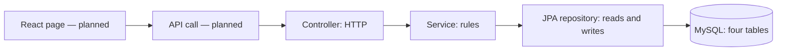

# Backend walkthrough — the MVP

Updated October 7, 2026 after instructor feedback. Start with one purchase. You do not need to explain every annotation before explaining what the program does.

## 1. The application in one sentence

> A customer submits a fictional purchase; the server checks the account and card, approves or declines it, saves the outcome, and returns the balance.

The same application can show history, reverse one approved purchase with a full refund, and let an admin freeze or reactivate an account.

The backend is implemented and tested. Login/JWT verification and the React customer/admin screens are still unfinished. The current frontend is only a home page. External API requests currently receive 401 because no authentication component establishes the caller yet. Tests supply that caller on mock server requests; they do not prove browser login works.

## 2. The path to follow



The result comes back through the same layers. Authentication will identify the caller before the controller runs.

| Package | What belongs here | Files |
| --- | --- | --- |
| Root | Start Spring Boot. | `CardSimulatorApplication` |
| `controller` | Receive HTTP input, call a service, return a safe response. | `AccountController`, `TransactionController`, `AdminController` only |
| `service` | Decide what may happen and coordinate database writes. | `AccountService`, `TransactionService` |
| `service` support | Check request IDs/page sizes; carry a saved result and whether it was a retry. | `RequestChecks`, `TransactionOutcome` |
| `repository` | Find and save rows. Spring implements these interfaces. | `AppUserRepository`, `CreditAccountRepository`, `DemoCardRepository`, `CardTransactionRepository` |
| `entity` | Map Java fields to the four database tables. | `AppUser`, `CreditAccount`, `DemoCard`, `CardTransaction` |
| `dto` | Define input and safe response fields. | Listed individually below. |
| `security` | Require a server-established caller and extract its ID. | `ApiIdentityFilter`, `AuthenticatedUser` |
| `exception` | Name a failure and translate it into an HTTP error. | `ApiExceptionHandler` and the seven exceptions below |
| `config` | Supply the UTC clock used for expiry and timestamps. | `UtcClockConfiguration` |

The entities follow foreign keys in one direction: account → user, card → account, transaction → account/card/original purchase. There are no reverse Java collections or user → account/card links. Repositories retrieve accounts, cards, and history when needed. The SQL relationships and four tables are unchanged.

## 3. Why these DTOs remain

A DTO is a small object describing data crossing the API boundary. An entity describes stored data. These jobs differ: the browser needs available credit and masked card details, and must never receive a password hash or an entire relationship graph.

There is **one request DTO**. A purchase has eight related inputs and validation rules, so keeping them together is useful. A refund and a status change each supply one parameter and have no request DTO.

| File in `dto` | Exact purpose |
| --- | --- |
| `PurchaseRequest` | Holds the eight purchase fields; validates their format. The controller passes this same object to the service. Card number and security code are write-only and excluded from `toString()`. |
| `AccountResponse` | Returns limit, outstanding balance, available credit, and status. |
| `CardResponse` | Returns only masked display details and fictional profile information. |
| `TransactionResponse` | Returns one saved purchase/refund outcome, date, reason, and balance snapshot. |
| `TransactionResultResponse` | Returns the transaction and current account summary together after a purchase/refund. |
| `AdminAccountResponse` | Adds owner ID, name, and email to the account summary for admin review. |
| `AdminTransactionResponse` | Adds owner email to a transaction summary for admin review. |
| `PageResponse` | Gives all three paginated lists the same items and total-count fields. |
| `ApiError` | Gives failures the same status, code, message, and UTC timestamp. |
| `ApiFormats` | A formatting helper, not a DTO: formats money and UTC timestamps for responses. |

`from(...)` methods copy the needed fields into a response. They do not approve purchases or update balances. Java `record` is shorthand for a small data carrier with a constructor and accessors; it does not add another framework.

Removed: `PurchaseCommand` (duplicated the purchase input), `RefundRequest`, `AccountStatusRequest`, `DecimalStringDeserializer`, and `CurrentUser` (ID extraction now lives on `AuthenticatedUser`). Swagger annotations/dependency and detailed request-context logging were also removed. Money uses Spring/Jackson's normal `BigDecimal` binding, accepting `"25.00"` or `25.00`; positive value, size, and decimal-place checks remain.

## 4. Follow one purchase in the actual code

Open these files under `backend/src/main/java/com/marvens/capstone/` in this order:

1. `controller/TransactionController.java`: `purchase()` receives the account ID and validated purchase body. It gets the caller's ID from `AuthenticatedUser` and calls `transactions.purchase(...)`.
2. `dto/PurchaseRequest.java`: identify the eight inputs. There is no conversion to a second command object.
3. `service/TransactionService.java`: read `purchase()` from top to bottom. It checks the stored customer role, locks the owned account, validates input, and looks for an existing request ID. A matching retry returns the saved transaction. Otherwise it verifies the assigned card and checks expiry, frozen status, and available credit.
4. `repository/CreditAccountRepository.java`: `findOwnedForUpdate()` requires both account ID and owner ID. Its write lock makes balance changes take turns.
5. `repository/DemoCardRepository.java`: finds the selected card within this account.
6. `repository/CardTransactionRepository.java`: looks up a previous request and saves the history row through JPA.
7. Back in `TransactionService.purchase()`: approval adds to the outstanding balance. A decline leaves it alone. Both create one history row. `@Transactional` commits the balance and history together or rolls them back together.
8. Back in `TransactionController.result()`: response DTOs select safe fields. New outcomes return 201; saved retries return 200.

> The controller handles the request. The service makes the decision. The repositories read and save the data. MySQL keeps it after the request ends.

## 5. Use these numbers when you practice

Start with a $1,000 limit and $200 outstanding balance. Available credit is $800.

| Action | Outstanding | Available | History |
| --- | --- | --- | --- |
| Purchase $50 with request A | $250 | $750 | One approved purchase |
| Retry the same purchase with request A | $250 | $750 | No new row |
| Purchase $900 with request B | $250 | $750 | One decline: insufficient credit |
| Refund the approved $50 purchase with request C | $200 | $800 | One refund linked to purchase A |

Say what changes and what stays the same before pointing at code. Then point to the service lines that make that happen.

Two different meanings of “transaction”: `CardTransaction` is one history row; a database transaction is the all-or-nothing boundary around multiple writes. A lock prevents two requests from using the same old balance. A request ID prevents one submission from creating two purchases. These three protections have different jobs.

## 6. The other workflows

| Workflow | Controller → service → repository |
| --- | --- |
| Account summary | `AccountController.getAccounts()` → `AccountService.getAccounts()` checks customer role → account by user ID → `AccountResponse`. |
| Masked card | `AccountController.getCards()` → `AccountService.getCards()` checks account ownership → card by account ID → `CardResponse`. |
| History | `TransactionController.history()` → `TransactionService.getHistory()` checks ownership → newest-first transaction page → `PageResponse<TransactionResponse>`. |
| Full refund | `TransactionController.refund()` takes purchase ID and `requestId` query parameter → `TransactionService.refund()` locks the owned account, verifies an approved purchase with no previous refund, subtracts the original amount, and saves a linked refund → transaction/account response. |
| Admin review | `AdminController` → the corresponding service checks ADMIN role → account or transaction page with owner details. |
| Freeze/reactivate | `AdminController.changeStatus()` takes account ID and `status` query parameter → `AccountService.changeStatus()` checks ADMIN role, locks account, saves ACTIVE/FROZEN → admin account response. |

Refunds copy their amount from the purchase. A frozen account may receive a refund. A purchase checks decline reasons in this order: expired card, frozen account, insufficient credit. Invalid input creates no history.

Pages start at 0, default to 20 rows, and cap at 50. Customer and admin transaction history use descending transaction ID; admin accounts use ascending account ID.

## 7. Explain errors without getting lost in support code

| Exception | Meaning | HTTP result |
| --- | --- | --- |
| `AuthenticationRequiredException` | No trusted caller | 401 |
| `AccessDeniedException` | Wrong stored role | 403 |
| `ResourceNotFoundException` | Missing or unowned resource | 404 |
| `InvalidPurchaseException` | Invalid purchase details | 400 |
| `InvalidRequestException` | Invalid request ID, page, size, or status | 400 |
| `RequestConflictException` | Request ID reused for different details | 409 |
| `RefundNotEligibleException` | Purchase cannot receive this full refund | 409 |

`ApiExceptionHandler` translates these failures and Spring input errors into `ApiError`. It uses fixed messages rather than repeating rejected values. Unexpected errors return 500; only their exception type and source locations are logged. The identity filter returns the same error shape before MVC runs. Full card numbers, security codes, passwords, and JWTs are never logged.

## 8. What to show as evidence

`TransactionServiceTest` demonstrates approval, decline, ownership, retries, expiry, and refund rules. `ControllerIT` follows mock HTTP requests through real services and MySQL. `ServiceIT` checks concurrent requests and rollback. Entity/repository checks verify the existing schema and queries. Tests use fictional fixtures and clean up only their own rows.

From `backend/`:

```powershell
.\mvnw.cmd verify
.\mvnw.cmd verify -Pmysql-verification "-Dspring.profiles.active=local"
```

The second command assumes credentials are in the ignored local profile; omit the profile argument if using environment variables. These commands do not prove browser authentication or measure a coverage percentage.

Verified October 7 after simplification: 99 checks without a database and 27 MySQL integration checks passed (126 total, no failures/errors/skips). The frontend production build also passed.

## 9. The remaining MVP, in order

1. Implement sign-in/registration with BCrypt and JWT verification. Keep a single clear authentication path; no browser-supplied user-ID shortcut.
2. Build the account dashboard and purchase form with page-owned React state and a small `fetch` helper.
3. Add history/refund and a simple admin page using the existing endpoints.
4. Rehearse approval → decline → refund → freeze with fictional data and write the corresponding Postman requests.

Card animation, extra component extraction, login rate limiting, CI, SonarQube, and a numerical coverage target are deferred polish. AWS and Jira are outside the approved project. Build the working path before adding polish.

For practice, explain one row of the workflow table without code, trace it in code, then change one input and predict the outcome. If the prediction is hard, stay with that workflow before moving on.
